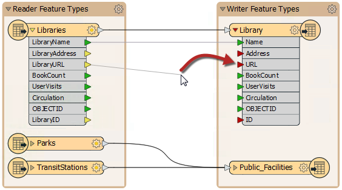
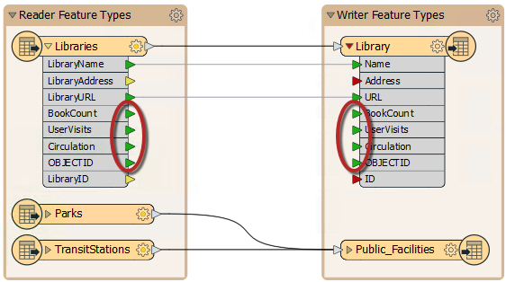

# Schema Mapping

Schema Mapping is the second key part of data restructuring in FME.

In FME Workbench, one side of the workspace shows the reader schema (*"what we have"*) and the other side shows the writer schema (*"what we want"*). Initially, the two schemas are automatically joined when the workspace is created, but when edits occur these connections are usually lost.

***Schema Mapping*** is the process of connecting the reader schema to the writer schema in a way that ensures the correct reader features are sent to the correct writer feature types and the correct reader attributes are sent to the correct writer attributes.

FME permits mapping from source to destination in any arrangement desired. There are no restrictions on what feature types or attributes may be mapped.

---

<!--Person X Says Section-->

<table style="border-spacing: 0px">
<tr>
<td style="vertical-align:middle;background-color:darkorange;border: 2px solid darkorange">
<i class="fa fa-quote-left fa-lg fa-pull-left fa-fw" style="color:white;padding-right: 12px;vertical-align:text-top"></i>
FME Lizard says...
</td>
</tr>

<tr>
<td style="border: 1px solid darkorange">

I think of schema editing and schema mapping as a means of reorganizing data.
  A good analogy is a wardrobe full of clothes. When the wardrobe is reorganized you throw out what you no longer need, reserve space for new clothes that you’re planning to get, and move existing items into a more usable arrangement.
  The same holds true for spatial data restructuring: it's the act of reorganizing data to make it more usable.

</td>
</tr>
</table>

---

## Feature Mapping
***Feature Mapping*** is the process of connecting source feature types to destination feature types.

Feature mapping is carried out by clicking the output port of a reader feature type, dragging the arrowhead to the input port of a writer feature type, and releasing the mouse button. A thick, black line represents connections.

Here, a connecting line from the source to the destination feature type is created by dragging the arrowhead from the source to the destination:

Merging and splitting of data is permitted:

Here a user requires both Parks, and TransitStations to be on a single layer in the output and so merges those two reader feature types into one writer feature type (Public_Facilities).

---

## Attribute Mapping
***Attribute Mapping*** is the process of connecting reader attributes to writer attributes.

Attribute mapping is performed by clicking the output port of a reader attribute, dragging the arrowhead to the input port of a writer attribute, and releasing the mouse button. Attribute connections are shown with a thinner, gray line.

Here feature mapping has been carried out already and attribute connections are being made:

Notice the green, yellow, and red color-coding that indicates which attributes are connected.

Green ports indicate a connected attribute. Yellow ports indicate a reader attribute that’s unconnected to a writer. Red ports indicate a writer attribute that’s unconnected to a reader.

Attributes with the same name in reader and writer feature types are connected automatically, even though a connecting line might not be visible; the port color is the key:

---

<!--Warning Section-->

<table style="border-spacing: 0px">
<tr>
<td style="vertical-align:middle;background-color:darkorange;border: 2px solid darkorange">
<i class="fa fa-exclamation-triangle fa-lg fa-pull-left fa-fw" style="color:white;padding-right: 12px;vertical-align:text-top"></i>
WARNING
</td>
</tr>

<tr>
<td style="border: 1px solid darkorange">

Names are case-sensitive, therefore ROADS is not the same as roads, Roads, or rOADS.
 That's important to know if you are relying on automatic attribute connections!

</td>
</tr>
</table>
