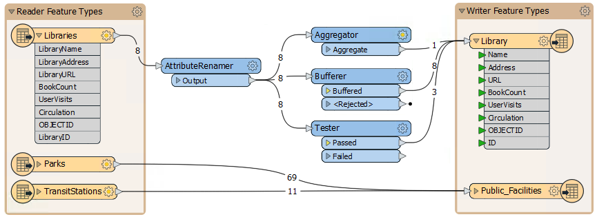
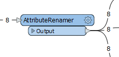
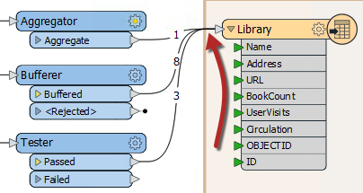

# Transformers used in Parallel #
A ***stream*** is a flow of data represented by connections in the workspace. A key concept in FME is the ability to have multiple parallel streams within a workspace. 
 
## Multiple Streams ##
Multiple streams are useful when a user needs to process the same data, but in a number of different ways. A workspace author can split one stream into several, or combine several streams of data into one, as required:

## Creating Multiple Streams ##
Splitting data can occur in a number of ways. Sometimes a transformer with multiple output ports (a Tester transformer is a good illustration of this) will divide (or filter) data with several possible output streams:

Additionally, a full stream of data can be duplicated by simply making multiple connections out of a single output port. In effect it creates a set of data for each connection.

Here FME reads 8 features but, because there are multiple connections, creates multiple copies of the data:

## Bringing Together Multiple Streams ##
When multiple streams are connected to the same input port no merging takes place. The data is simply accumulated into a single stream. This is often called a *union*.

Here, three streams of data converge into a writer feature type:

No merging takes place; the data simply accumulates into 15 distinct features in the output dataset. To carry out actual merging of data requires a specific transformer such as the FeatureMerger or FeatureJoiner.