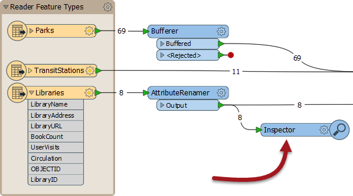
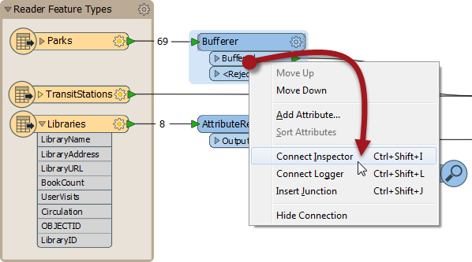

# Data Inspection Using FME Workbench #
Besides Redirect to FME Data Inspector, Workbench can route data to the FME Data Inspector from individual transformers.

 
## Using an Inspector Transformer ##
An ***Inspector*** is a Workbench transformer – with its own distinctive look and style – that causes data entering it to be directed to FME Data Inspector, even mid-translation.

An Inspector - like any transformer - can be applied at any point in a translation and does not prevent the data being output to the writer. It also lets a user be selective about which features should be inspected:

In this case it's also a form of parallel streams, since the data is duplicated, but that does not need to be the case.

## Placing an Inspector Transformer ##
The best, and simplest way to apply an Inspector is to right-click the output port of an object in a workspace and select the Connect Inspector option.

Here the user right-clicks the Buffered port of a Bufferer transformer and chooses the option Connect Inspector:

Notice that an Inspector is named automatically using the transformer and output port names. Here it will be "Bufferer_Buffered". This helps to identify the data from this Inspector (as opposed to any others) in the FME Data Inspector.

Note that the Inspector transformer only opens the FME Data Inspector when there are features to view. If there are zero features, then the Data Inspector will not open!

---

<!--Tip Section--> 

<table style="border-spacing: 0px">
<tr>
<td style="vertical-align:middle;background-color:darkorange;border: 2px solid darkorange">
<i class="fa fa-info-circle fa-lg fa-pull-left fa-fw" style="color:white;padding-right: 12px;vertical-align:text-top"></i>
TIP
</td>
</tr>

<tr>
<td style="border: 1px solid darkorange">

Inspectors are not useful for a workspace that is to be put into production, especially on FME Server. That's because an FME Server engine doesn't have to capability to open a Data Inspector. For that reason, authors of FME Server workspaces tend to use a Logger transformer instead of an Inspector.

</td>
</tr>
</table>

---

<!--Person X Says Section-->

<table style="border-spacing: 0px">
<tr>
<td style="vertical-align:middle;background-color:darkorange;border: 2px solid darkorange">
<i class="fa fa-quote-left fa-lg fa-pull-left fa-fw" style="color:white;padding-right: 12px;vertical-align:text-top"></i>
Mr. E. Dict, (Attorney of FME Law) says...
</td>
</tr>

<tr>
<td style="border: 1px solid darkorange">

Pursuant to clause d30 (section 43) in your training course agreement, you are required to re-open the workspace from the previous example and add Inspector transformers to practice using this functionality.
  

</td>
</tr>
</table>