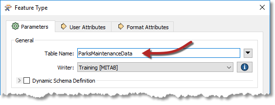
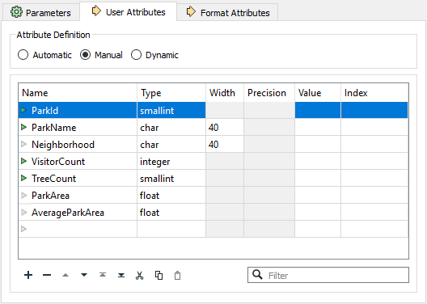
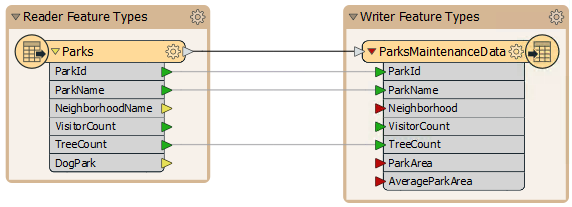
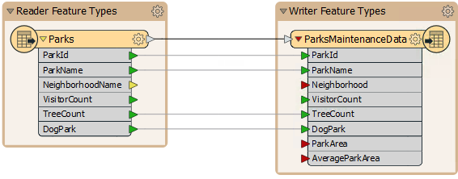

<!--Exercise Section-->

<table style="border-spacing: 0px;border-collapse: collapse;font-family:serif">
<tr>
<td width=25% style="vertical-align:middle;background-color:darkorange;border: 2px solid darkorange">
<i class="fa fa-cogs fa-lg fa-pull-left fa-fw" style="color:white;padding-right: 12px;vertical-align:text-top"></i>
Exercise 1
</td>
<td style="border: 2px solid darkorange;background-color:darkorange;color:white">
Grounds Maintenance Project - Schema Editing
</td>
</tr>

<tr>
<td style="border: 1px solid darkorange; font-weight: bold">Data</td>
<td style="border: 1px solid darkorange">City Parks (MapInfo TAB)</td>
</tr>

<tr>
<td style="border: 1px solid darkorange; font-weight: bold">Overall Goal</td>
<td style="border: 1px solid darkorange">Calculate the size and average size of each park in the city, to use in Grounds Maintenance estimates for grass cutting, hedge trimming, etc.</td>
</tr>

<tr>
<td style="border: 1px solid darkorange; font-weight: bold">Demonstrates</td>
<td style="border: 1px solid darkorange">Structural Transformation, Schema Editing</td>
</tr>

<tr>
<td style="border: 1px solid darkorange; font-weight: bold">Start Workspace</td>
<td style="border: 1px solid darkorange">None</td>
</tr>

<tr>
<td style="border: 1px solid darkorange; font-weight: bold">End Workspace</td>
<td style="border: 1px solid darkorange">C:\FMEData2019\Workspaces\DesktopBasic\Transformation-Ex1-Complete.fmw</td>
</tr>

</table>

You have just landed a job as a technical analyst in the GIS department of your local city.

The team responsible for maintaining parks and other grassed areas needs to know the area and facilities of each park in order to plan their budget for the upcoming year. You have been assigned to this project and will use FME to provide a dataset of this information.

The first step in this example is to rename existing attributes and create new ones in preparation for the later area calculations.

 **1) Start FME Workbench**
 Start FME Workbench, then use the Generate Workspace dialog to create a workspace using these parameters:

<table style="border: 0px">

<tr>
<td style="font-weight: bold">Reader Format</td>
<td style="">MapInfo TAB (MITAB)</td>
</tr>

<tr>
<td style="font-weight: bold">Reader Dataset</td>
<td style="">C:\FMEData2019\Data\Parks\Parks.tab</td>
</tr>

<tr>
<td style="font-weight: bold">Writer Format</td>
<td style="">MapInfo TAB (MITAB)</td>
</tr>

<tr>
<td style="font-weight: bold">Writer Dataset</td>
<td style="">C:\FMEData2019\Output\Training</td>
</tr>

</table>

Yes! Here we write back to the same format of data we are reading from! You may click the Parameters buttons in the Generate Workspace dialog to check the reader/writer parameters, but none of them need changing in this exercise. Note that the writer needs only a folder and not a specific file name.

 **2) Rename Feature Type**
 FME creates a workspace where the destination schema matches the source. However, the end user of the data has requested parts of the schema are cleaned up.

Inspect the writer feature type parameters. Click in the field labeled Table Name (remember this label is format-specific and in MapInfo we deal with "tables") and change the name from Parks to ParksMaintenanceData:

 **3) Update Attributes**
 Now inspect the user attributes. They will look like this:

These must be cleaned up so that unnecessary information is removed. Other attributes need to be updated and some extra ones added to store the calculation results. So carry out the following actions:

<table style="border: 0px">

<tr>
<td style="font-weight: bold">Delete Attribute</td>
<td style="">RefParkID</td>
</tr>

<tr>
<td style="font-weight: bold">Delete Attribute</td>
<td style="">DogPark</td>
</tr>

<tr>
<td style="font-weight: bold">Delete Attribute</td>
<td style="">Washrooms</td>
</tr>

<tr>
<td style="font-weight: bold">Delete Attribute</td>
<td style="">SpecialFeatures</td>
</tr>

<tr>
<td style="font-weight: bold">Rename Attribute</td>
<td style="">from: NeighborhoodName</td>
<td style="">to: Neighborhood</td>
</tr>

<tr>
<td style="font-weight: bold">Change Type (VisitorCount)</td>
<td style="">from: smallint</td>
<td style="">to: integer</td>
</tr>

<tr>
<td style="font-weight: bold">Add Attribute</td>
<td style="">ParkArea</td>
<td style="">type: Float</td>
</tr>

<tr>
<td style="font-weight: bold">Add Attribute</td>
<td style="">AverageParkArea</td>
<td style="">type: Float</td>
</tr>

</table>

The attribute list should now look like this:

Now when the workspace is run the output will be named ParksMaintenanceData.tab and will contain an updated attribute schema.

 **4) Un-Expose Source Attributes**
 The workspace will now look like this:

---

<!--Tip Section-->

<table style="border-spacing: 0px">
<tr>
<td style="vertical-align:middle;background-color:darkorange;border: 2px solid darkorange">
<i class="fa fa-info-circle fa-lg fa-pull-left fa-fw" style="color:white;padding-right: 12px;vertical-align:text-top"></i>
TIP
</td>
</tr>

<tr>
<td style="border: 1px solid darkorange">

Objects on the canvas can be resized (as in the above screenshot) if the feature type name or attribute names are too large to be displayed properly at the default size. The brown markers around the feature types are called <strong>bookmarks</strong>. They too can be resized to better fit their contents.

</td>
</tr>
</table>

---

Notice there are several source attributes that are not going to be used in the workspace or sent to the output. We can tidy the workspace by hiding these.

Inspect the User Attributes tab on the reader feature type parameters. It will look like this:

Uncheck the checkbox for the following attributes, which we do not need:

- RefParkID
- Washrooms
- SpecialFeatures

This is the list of attributes we deleted, except for DogParks, which we will make use of in the translation.

Click Apply/OK to confirm the changes.

 **5) Save the Workspace**
 Save the workspace – it will be completed in further examples. It should now look like this:

---
<!--Person X Says Section-->

<table style="border-spacing: 0px">
<tr>
<td style="vertical-align:middle;background-color:darkorange;border: 2px solid darkorange">
<i class="fa fa-quote-left fa-lg fa-pull-left fa-fw" style="color:white;padding-right: 12px;vertical-align:text-top"></i>
FME Lizard says...
</td>
</tr>

<tr>
<td style="border: 1px solid darkorange">

Some Writer attributes have red connection arrows because there is nothing to map them to yet (ParkArea or AverageParkArea) or the name has changed (Neighborhood). While VisitorCount is green but doesn't show a connection line, this is because the data is still the same yet the output data type has changed.
  You can still run this workspace just to see what the output looks like anyway.

</td>
</tr>
</table>

---

<!--Exercise Congratulations Section-->

<table style="border-spacing: 0px">
<tr>
<td style="vertical-align:middle;background-color:darkorange;border: 2px solid darkorange">
<i class="fa fa-thumbs-o-up fa-lg fa-pull-left fa-fw" style="color:white;padding-right: 12px;vertical-align:text-top"></i>
CONGRATULATIONS
</td>
</tr>

<tr>
<td style="border: 1px solid darkorange">

By completing this exercise you have learned how to:
 
<ul><li>Edit the attributes on a writer schema</li>
<li>Edit the output layer name on a writer schema</li>
<li>Hide attributes on a reader schema</li></ul>

</td>
</tr>
</table>
