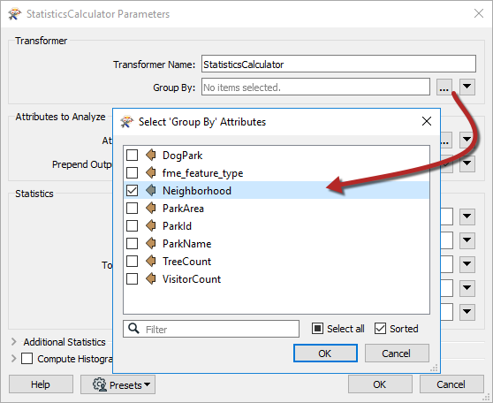

<!--Exercise Section-->

<table style="border-spacing: 0px;border-collapse: collapse;font-family:serif">
<tr>
<td width=25% style="vertical-align:middle;background-color:darkorange;border: 2px solid darkorange">
<i class="fa fa-cogs fa-lg fa-pull-left fa-fw" style="color:white;padding-right: 12px;vertical-align:text-top"></i>
Exercise 5
</td>
<td style="border: 2px solid darkorange;background-color:darkorange;color:white">
Grounds Maintenance Project - Neighborhood Averages
</td>
</tr>

<tr>
<td style="border: 1px solid darkorange; font-weight: bold">Data</td>
<td style="border: 1px solid darkorange">City Parks (MapInfo TAB)</td>
</tr>

<tr>
<td style="border: 1px solid darkorange; font-weight: bold">Overall Goal</td>
<td style="border: 1px solid darkorange">Calculate the size and average size of each park in the city, to use in Grounds Maintenance estimates for grass cutting, hedge trimming, etc.</td>
</tr>

<tr>
<td style="border: 1px solid darkorange; font-weight: bold">Demonstrates</td>
<td style="border: 1px solid darkorange">Group-By Processing</td>
</tr>

<tr>
<td style="border: 1px solid darkorange; font-weight: bold">Start Workspace</td>
<td style="border: 1px solid darkorange">C:\FMEData2019\Workspaces\DesktopBasic\Transformation-Ex5-Begin.fmw</td>
</tr>

<tr>
<td style="border: 1px solid darkorange; font-weight: bold">End Workspace</td>
<td style="border: 1px solid darkorange">C:\FMEData2019\Workspaces\DesktopBasic\Transformation-Ex5-Complete.fmw</td>
</tr>

</table>

Let's continue your work on the grounds maintenance project.

The parks team has decided that they do not want the average area of parks for the city as a whole. Instead, they want the average size of parks in each neighborhood; so let's do that for them.

 **1) Start FME Workbench**
 Start FME Workbench (if necessary) and open the workspace from Exercise 4. Alternatively you can open C:\FMEData2019\Workspaces\DesktopBasic\Transformation-Ex5-Begin.fmw

 **2) Set Group-By in the StatisticsCalculator**
 This is a straightforward task. View the parameters for the StatisticsCalculator transformer and click the 'browse' button next to the Group By parameter. Select the attribute called Neighborhood:

Click OK/Apply to apply the changes to the transformer.

 **3) Run the Workspace**
 Save and then run the workspace.

Inspect the output data in the Table View window in the Visual Preview window. Click on the Neighborhood column to sort the neighborhoods.

You should see that each neighborhood now has its own value for AverageParkArea:

---

<!--Exercise Congratulations Section-->

<table style="border-spacing: 0px">
<tr>
<td style="vertical-align:middle;background-color:darkorange;border: 2px solid darkorange">
<i class="fa fa-thumbs-o-up fa-lg fa-pull-left fa-fw" style="color:white;padding-right: 12px;vertical-align:text-top"></i>
CONGRATULATIONS
</td>
</tr>

<tr>
<td style="border: 1px solid darkorange">

By completing this exercise you have learned how to:
 
<ul><li>Use the group-by parameter in FME transformers</li></ul>

</td>
</tr>
</table>
