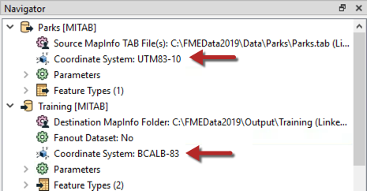

<!--Exercise Section-->

<table style="border-spacing: 0px;border-collapse: collapse;font-family:serif">
<tr>
<td width=25% style="vertical-align:middle;background-color:darkorange;border: 2px solid darkorange">
<i class="fa fa-cogs fa-lg fa-pull-left fa-fw" style="color:white;padding-right: 12px;vertical-align:text-top"></i>
Exercise 6
</td>
<td style="border: 2px solid darkorange;background-color:darkorange;color:white">
Grounds Maintenance Project - Data Reprojection
</td>
</tr>

<tr>
<td style="border: 1px solid darkorange; font-weight: bold">Data</td>
<td style="border: 1px solid darkorange">City Parks (MapInfo TAB)</td>
</tr>

<tr>
<td style="border: 1px solid darkorange; font-weight: bold">Overall Goal</td>
<td style="border: 1px solid darkorange">Calculate the size and average size of each park in the city, to use in Grounds Maintenance estimates for grass cutting, hedge trimming, etc.</td>
</tr>

<tr>
<td style="border: 1px solid darkorange; font-weight: bold">Demonstrates</td>
<td style="border: 1px solid darkorange">Data reprojection</td>
</tr>

<tr>
<td style="border: 1px solid darkorange; font-weight: bold">Start Workspace</td>
<td style="border: 1px solid darkorange">C:\FMEData2019\Workspaces\DesktopBasic\DataTransformation-Ex6-Begin.fmw</td>
</tr>

<tr>
<td style="border: 1px solid darkorange; font-weight: bold">End Workspace</td>
<td style="border: 1px solid darkorange">C:\FMEData2019\Workspaces\DesktopBasic\DataTransformation-Ex6-Complete.fmw C:\FMEData2019\Workspaces\DesktopBasic\DataTransformation-Ex6-Complete-Advanced.fmw</td>
</tr>

</table>

Let's continue your work on the grounds maintenance project.

The parks team has decided that the output data should be in an Albers Equal Area projection (coordinate system = BCALB-83). They think it will take ages to set this up! We'll show them differently.

 **1) Start FME Workbench**
 Start FME Workbench (if necessary) and open the workspace from Exercise 5. Alternatively you can open C:\FMEData2019\Workspaces\DesktopBasic\DataTransformation-Ex6-Begin.fmw

 **2) Edit Source (Reader) Coordinate System**
 In the Navigator window locate the Parks [MITAB] reader, and expand its list of settings.

Locate the setting labeled ‘Coordinate System’. The original value should be &lt;not set&gt;:

Double-click the reader Coordinate System parameter to open an edit dialog.

In the Coordinate System field enter the name UTM83-10 or select it from the Coordinate System Gallery by selecting "More Coordinate Systems..." from the bottom of the drop-down list:

---

<!--Tip Section-->

<table style="border-spacing: 0px">
<tr>
<td style="vertical-align:middle;background-color:darkorange;border: 2px solid darkorange">
<i class="fa fa-info-circle fa-lg fa-pull-left fa-fw" style="color:white;padding-right: 12px;vertical-align:text-top"></i>
TIP
</td>
</tr>

<tr>
<td style="border: 1px solid darkorange">

Remember, when a reader’s Coordinate System parameter is defined as &lt;not set&gt; FME will automatically try to determine the correct coordinate system from the dataset itself.
  When the source dataset is in a format that stores coordinate system information (as it does in this example) you can safely leave the parameter unset. So this step isn’t really necessary.
  However, you MUST set this parameter when you wish to reproject source data that does not store coordinate system information; otherwise an error will occur in the translation.

</td>
</tr>
</table>

---

 **3) Edit Destination (Writer) Coordinate System**
 Now locate the coordinate system setting for the destination (writer) dataset.

Again the current value should be the default of &lt;not set&gt;.

Double-click the parameter and enter the coordinate system name BCALB-83 or select it from the Coordinate System Gallery by selecting "More Coordinate Systems..." from the bottom of the drop-down list.

The Navigator window will now look like this:

 **4) Run the Workspace**
 Save and then run the workspace.

In the log file you should be able to find:

<pre>
FME Configuration: Source coordinate system for reader MITAB_1[MITAB] set to `UTM83-10'
FME Configuration: Destination coordinate system set to `BCALB-83'
</pre>

 **5) Inspect the Output**

Open the newly reprojected dataset and query a feature. The Feature Information window should report that the data is now in BCALB-83. Optionally, click on the coordinate system name in that window; a new dialog will open to display all of the coordinate system parameters.

---

<!--Tip Section-->

<table style="border-spacing: 0px">
<tr>
<td style="vertical-align:middle;background-color:darkorange;border: 2px solid darkorange">
<i class="fa fa-info-circle fa-lg fa-pull-left fa-fw" style="color:white;padding-right: 12px;vertical-align:text-top"></i>
TIP
</td>
</tr>

<tr>
<td style="border: 1px solid darkorange">

If the background map is activated when a dataset is opened then the contents of that dataset are automatically reprojected to Spherical Mercator to match the background map. If you wish to see the data as it appears in its own coordinate system, then click on your background map name in the Visual Preview window, and select Background Map Off.

</td>
</tr>
</table>

---

<!--Advanced Exercise Section-->

<table style="border-spacing: 0px">
<tr>
<td style="vertical-align:middle;background-color:darkorange;border: 2px solid darkorange">
<i class="fa fa-cogs fa-lg fa-pull-left fa-fw" style="color:white;padding-right: 12px;vertical-align:text-top"></i>
Advanced Exercise
</td>
</tr>

<tr>
<td style="border: 1px solid darkorange">

Instead of using the reader/writer parameters in the Navigator window, why not try this exercise using the Reprojector (or CSMapReprojector) transformer? Where should the transformer be placed in the workspace and why is this important?

</td>
</tr>
</table>

---

<!--Exercise Congratulations Section-->

<table style="border-spacing: 0px">
<tr>
<td style="vertical-align:middle;background-color:darkorange;border: 2px solid darkorange">
<i class="fa fa-thumbs-o-up fa-lg fa-pull-left fa-fw" style="color:white;padding-right: 12px;vertical-align:text-top"></i>
CONGRATULATIONS
</td>
</tr>

<tr>
<td style="border: 1px solid darkorange">

By completing this exercise you have learned how to:
 
<ul><li>Use Coordinate System parameters to reproject spatial data</li>
<li>Query features in the Data Inspector to inspect coordinate system information</li></ul>

</td>
</tr>
</table>
