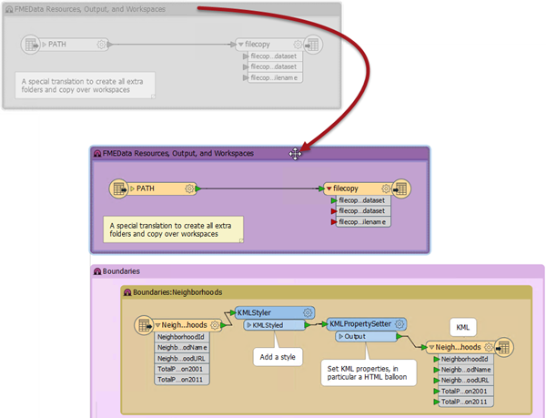

### Bookmarks for Editing ###
Bookmarks define a section of workspace containing a number of objects. When editing a workspace without bookmarks, moving objects is done by selecting the object or objects and dragging them to a new position. 

However, when a workspace is divided by bookmarks, objects can be moved by simply dragging the bookmark to a new position. When an object is located inside the bookmark, it moves as the bookmark does. 

Using this technique large groups of objects can be moved about the workspace canvas, in order to create a clearer layout.

#### The Magnet Icon ####
Each bookmark in FME has a *magnet* icon in its top-left corner. Clicking on the icon toggles it from active to inactive (and vice versa).

An inactive magnet (colored blue) allows the bookmark to be moved without disturbing the contents. It's useful when you need to reposition the bookmark without also moving its contents.

---

<!--Person X Says Section-->

<table style="border-spacing: 0px">
<tr>
<td style="vertical-align:middle;background-color:darkorange;border: 2px solid darkorange">
<i class="fa fa-quote-left fa-lg fa-pull-left fa-fw" style="color:white;padding-right: 12px;vertical-align:text-top"></i>
Miss Vector says...
</td>
</tr>

<tr>
<td style="border: 1px solid darkorange">

Here are some Best Practice questions. You do want to be the best, don't you?
  Which of the following is NOT a method of creating a bookmark?
  <a href="http://52.73.3.37/fmedatastreaming/Manual/QAResponse2017.fmw?chapter=3&question=1&answer=1&DestDataset_TEXTLINE=C%3A%5CFMEOutput%5CQAResponse.html">1. Click the Insert Bookmark button on the toolbar</a>
 <a href="http://52.73.3.37/fmedatastreaming/Manual/QAResponse2017.fmw?chapter=3&question=1&answer=2&DestDataset_TEXTLINE=C%3A%5CFMEOutput%5CQAResponse.html">2. Select a transformer, right click, choose Create Bookmark</a>
 <a href="http://52.73.3.37/fmedatastreaming/Manual/QAResponse2017.fmw?chapter=3&question=1&answer=3&DestDataset_TEXTLINE=C%3A%5CFMEOutput%5CQAResponse.html">3. Select multiple transformers, right click, choose Create Bookmark</a>
 <a href="http://52.73.3.37/fmedatastreaming/Manual/QAResponse2017.fmw?chapter=3&question=1&answer=4&DestDataset_TEXTLINE=C%3A%5CFMEOutput%5CQAResponse.html">4. Use the Ctrl+B shortcut</a>
  Which of these is NOT a type of annotation in FME Workbench?
  <a href="http://52.73.3.37/fmedatastreaming/Manual/QAResponse2017.fmw?chapter=3&question=2&answer=1&DestDataset_TEXTLINE=C%3A%5CFMEOutput%5CQAResponse.html">1. Header Annotation</a>
 <a href="http://52.73.3.37/fmedatastreaming/Manual/QAResponse2017.fmw?chapter=3&question=2&answer=2&DestDataset_TEXTLINE=C%3A%5CFMEOutput%5CQAResponse.html">2. Parameter Annotation</a>
 <a href="http://52.73.3.37/fmedatastreaming/Manual/QAResponse2017.fmw?chapter=3&question=2&answer=3&DestDataset_TEXTLINE=C%3A%5CFMEOutput%5CQAResponse.html">3. User Annotation</a>
 <a href="http://52.73.3.37/fmedatastreaming/Manual/QAResponse2017.fmw?chapter=3&question=2&answer=4&DestDataset_TEXTLINE=C%3A%5CFMEOutput%5CQAResponse.html">4. Summary Annotation</a>

</td>
</tr>
</table>

