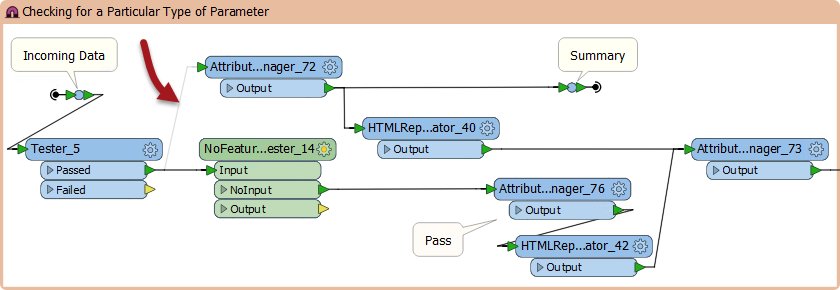
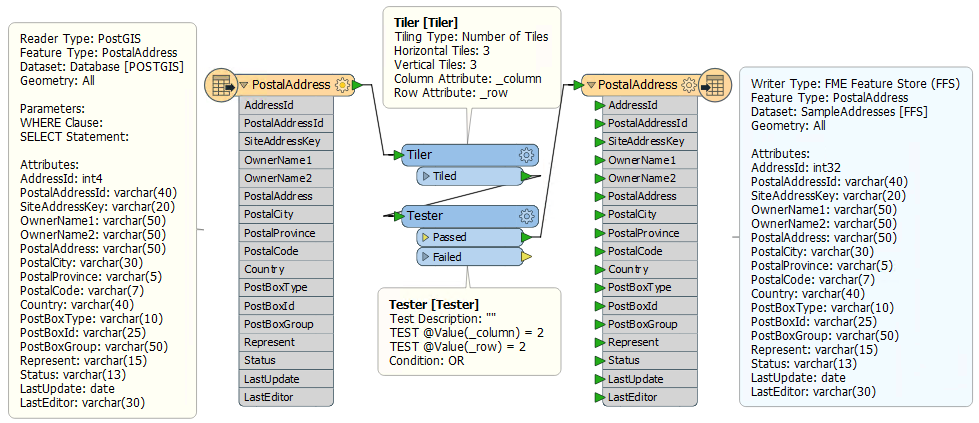

## Prototyping ##

In the classical sense, prototyping means creating an incomplete application as a way to evaluate the feasibility of a project.

Here we'll stretch the definition to mean how to build a complex FME project incrementally; starting with an empty workspace and building it piece by piece to deliver a result that matches the final specification.

---

### Incremental Development ###

The key development technique for FME workspaces is [incremental updates](https://en.wikipedia.org/wiki/Incremental_build_model). 

The steps to this technique are:

- Plan your project as a series of small sections, each of which would fit inside a bookmark in FME
- Design and implement a section in FME Workbench. It should ideally be between 3-10 transformers.
- Run and test a section immediately it is complete. That way you can identify problems at an early stage, and identify them more easily because only a few changes are being made in any increment.
- Repeat the process, testing whenever you've added a new section

Although a range of 3-10 transformers is an arbitrary number, the more transformers you add the more difficult it would be to identify the source of any problems. Beyond ten transformers is the point at which you should consider chopping that process into smaller sections.

Here a user is testing a newly added section of workspace. By disabling the connection to a parallel section the user is not re-testing part of the workspace that they already know works.

---

### Source Data ###

When the FME project is large and complex, it's likely that the source data will be large and complex too. Here are some suggestions for how to handle that when developing a project.

- You should - as noted above - create a workspace in small increments, testing it after each section is created. However, you should not be using the entirety of a large source dataset to do so. It's better to use a sample of the source data, preferably a sample that is geographically continuous, and do your testing on that.
- Rather than read a sample of data from the source, it can be better to extract that data into a separate dataset and use that for testing. FME's own format - FFS - is a good choice of format to store this sample dataset. That's because the data is stored using FME's comprehensive data model, and is also in the same structure that FME would use when reading from the actual dataset.
- Databases are a case where extracting a source sample is particularly important. There's no need to be waiting for network traffic and a database response in order to test a small section of workspace.

Here the workspace author is extracting a section of source data by reading from a database, splitting it into tiles, and writing just one tile to the FFS format. This one tile can be used for prototyping a solution in a way that is representative of the entire source database table. 

---

<!--Tip Section--> 

<table style="border-spacing: 0px">
<tr>
<td style="vertical-align:middle;background-color:darkorange;border: 2px solid darkorange">
<i class="fa fa-info-circle fa-lg fa-pull-left fa-fw" style="color:white;padding-right: 12px;vertical-align:text-top"></i>
TIP
</td>
</tr>

<tr>
<td style="border: 1px solid darkorange">

If you have colleagues who also use FME, why not ask them to review your work? All code that goes into the FME product line is reviewed before it is committed, so there is no reason why your workspaces should not be too.
 A reviewer should check to see if there are any mistakes in the workspace logic, if there are any obvious improvements that could be made, or if there are any alternative methods to your approach that would bring performance benefits.

</td>
</tr>
</table>

---

### Separate Environments ###

Large projects are often multi-stage processes; for example Development, Testing, Acceptance, and Production ([DTAP](https://en.wikipedia.org/wiki/Development,_testing,_acceptance_and_production)). 

Ideally, when creating a project, you will have a separate environment for each stage. This includes a different installation of FME, a separate database, and any other aspects of your project.

When transferring an FME project from one environment to another, some things you need to check and possibly adjust are:

- System credentials and accounts for accessing resources such as filesystems and databases
- Environment variables used inside a workspace, for example as source data paths
- URLs that point to web services inside a particular environment 
- Database connections that point to a database inside a particular environment
- Custom code (in Python for example) that references resources that are environment dependent

---

### Version Control ###

The easiest mistake to make with a large FME project is to keep working on a single workspace file. There are two problems with this:

- Faults cannot be easily tracked because there is no record of what has changed and when
- It is not easy to create different versions for different platforms
- If the workspace file is lost or corrupted then the entire project is lost

Therefore, it is better to keep versioned workspaces, where a different copy is kept for each set of revisions.

In fact, it is a good idea to keep and version all materials related to an FME project, including:

- Workspace files
- Python files
- Log Files
- Source Datasets

<!--Warning Section--> 

<table style="border-spacing: 0px">
<tr>
<td style="vertical-align:middle;background-color:darkorange;border: 2px solid darkorange">
<i class="fa fa-exclamation-triangle fa-lg fa-pull-left fa-fw" style="color:white;padding-right: 12px;vertical-align:text-top"></i>
WARNING
</td>
</tr>

<tr>
<td style="border: 1px solid darkorange">

It's better to not store any information that is personal or that includes passwords. Also there's no need to store temporary files.

</td>
</tr>
</table>
