<!--Exercise Section-->

<table style="border-spacing: 0px;border-collapse: collapse;font-family:serif">
<tr>
<td width=25% style="vertical-align:middle;background-color:darkorange;border: 2px solid darkorange">
<i class="fa fa-cogs fa-lg fa-pull-left fa-fw" style="color:white;padding-right: 12px;vertical-align:text-top"></i>
Exercise 4
</td>
<td style="border: 2px solid darkorange;background-color:darkorange;color:white">
FME Hackathon
</td>
</tr>

<tr>
<td style="border: 1px solid darkorange; font-weight: bold">Data</td>
<td style="border: 1px solid darkorange">Roads (Autodesk AutoCAD DWG and/or PostGIS)</td>
</tr>

<tr>
<td style="border: 1px solid darkorange; font-weight: bold">Overall Goal</td>
<td style="border: 1px solid darkorange">Find the shortest route from the hackathon to an Italian Cafe</td>
</tr>

<tr>
<td style="border: 1px solid darkorange; font-weight: bold">Demonstrates</td>
<td style="border: 1px solid darkorange">Data Translation, Transformation, and Best Practice</td>
</tr>

<tr>
<td style="border: 1px solid darkorange; font-weight: bold">Start Workspace</td>
<td style="border: 1px solid darkorange">None</td>
</tr>

<tr>
<td style="border: 1px solid darkorange; font-weight: bold">End Workspace</td>
<td style="border: 1px solid darkorange">C:\FMEData2017\Workspaces\DesktopBasic\BestPractice-Ex4-Complete.fmwt</td>
</tr>

</table>

A regional GIS group is holding an FME Hackathon and you have been invited to take part.

You have been provided with a set of source data and asked to create a useful project from it. You decide that it would be interesting to produce a tool that maps the route from the hackathon venue to a cafe the where a group get-together will be held that evening.  

So, your task is to use the data available to you to calculate the best route from the convention centre to the cafe, and to write out that data to GPX format so folk can use it in their GPS/mobile device.

---

**1) Create Database Connection**
 The source data has been provided in a PostGIS database; therefore our first task should be to create a connection to it. That way we can use the connection instead of having to enter connection parameters.

In a web browser visit [http://fme.ly/database](http://fme.ly/database) - this will show the parameters for a PostGIS database running on Amazon RDS.

In Workbench, select Tools > FME Options from the menubar

Click on the icon for the Database Connections category, then click the [+] button to create a new connection. In the "Add Database Connection" dialog, first select PostgreSQL as the database type. Then enter the connection parameters obtained through the web browser.

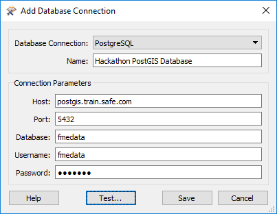

Give the connection a name and click Save. Then click OK to close the FME Options dialog.

<!--Tip Section--> 

<table style="border-spacing: 0px">
<tr>
<td style="vertical-align:middle;background-color:darkorange;border: 2px solid darkorange">
<i class="fa fa-info-circle fa-lg fa-pull-left fa-fw" style="color:white;padding-right: 12px;vertical-align:text-top"></i>
TIP
</td>
</tr>

<tr>
<td style="border: 1px solid darkorange">

The completed workspace for this exercise uses a database connection called <strong>Hackathon PostGIS Database</strong>
 If you wish to open/use this workspace, you should create your connection with the same name. That way when you open the workspace it will automatically find a matching connection. 
  This is a good illustration of the importance of naming conventions for database (and web) connections.

</td>
</tr>
</table>
 

**2) Inspect Data**
 Start the FME Data Inspector to inspect the dataset we will be using. Select File > Open Dataset and, when prompted, enter the following:

<table style="border: 0px">

<tr>
<td style="font-weight: bold">Reader Format</td>
<td style="">PostGIS</td>
</tr>

<tr>
<td style="font-weight: bold">Reader Dataset</td>
<td style="">Hackathon PostGIS Database</td>
</tr>

<tr>
<td style="font-weight: bold">Parameters</td>
<td style="">Table List: public.CompleteRoads</td>
</tr>

</table>

Click OK to close the dialogs and open the data. You will see a set of road features each of which has a set of attributes. One attribute specifies whether a feature represents a one-way street. It's important to know this if we want to calculate a route that is actually legal!

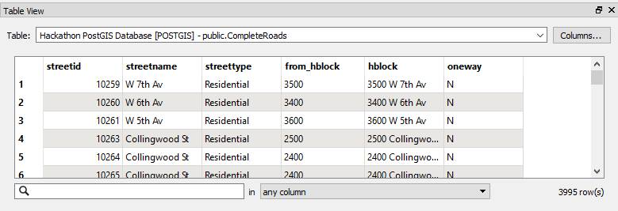

**NB:** *If you have any problems using the PostGIS database - for example connectivity problems with a firewall - then the following AutoCAD dataset can be substituted with very few changes required:*

<table style="border: 0px">

<tr>
<td style="font-weight: bold">Reader Format</td>
<td style="">Autodesk AutoCAD DWG/DXF</td>
</tr>

<tr>
<td style="font-weight: bold">Reader Dataset</td>
<td style="">C:\FMEData2017\Data\Transportation\CompleteRoads.dwg</td>
</tr>

</table>

 **3) Start Workbench**
 Start Workbench and use the option to Generate a workspace.

<table style="border: 0px">

<tr>
<td style="font-weight: bold">Reader Format</td>
<td style="">PostGIS</td>
</tr>

<tr>
<td style="font-weight: bold">Reader Dataset</td>
<td style="">Hackathon PostGIS Database</td>
</tr>

<tr>
<td style="font-weight: bold">Parameters</td>
<td style="">Table List: public.CompleteRoads</td>
</tr>

<tr>
<td style="font-weight: bold">Writer Format</td>
<td style="">GPS eXchange Format (GPX)</td>
</tr>

<tr>
<td style="font-weight: bold">Writer Dataset</td>
<td style="">C:\FMEData2017\Output\Training\Route.gpx</td>
</tr>

</table>

The workspace will look like this:

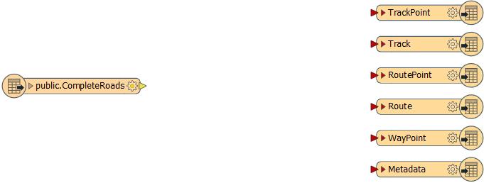

Remember, GPX is a fixed-schema format, hence the six different writer feature types that are automatically created. For the sake of Best Practice, you may want to put a bookmark around these features.

 **4) Add ShortestPathFinder**
 Now we need to start calculating a route. The obvious first step is to add a ShortestPathFinder transformer, which is how we can calculate our route.

So, add a ShortestPathFinder transformer. Connect public.CompleteRoads to the Network port.

 **5) Add Creator**
 The other input port on the ShortestPathFinder is for the From-To path (the start and end points of our journey). There are many ways to create this - or even accept input from a web map - but here we'll just manually create a feature with the Creator transformer. 

So, add a Creator transformer and connect it to the From-To port:

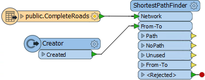

View the Creator's parameters.

Firstly enter UTM83-10 as the coordinate system of the data we are about to create. For the Geometry Object parameter, click the [...] browse button to the right to open a geometry-creation dialog. Select Line as the geometry type and enter the following coordinates:

<pre>
X 491500 Y 5459550
X 494500 Y 5457440
</pre>

The first coordinate is that of the hackathon venue and the second is the closest point in our network to the cafe we're going to visit.

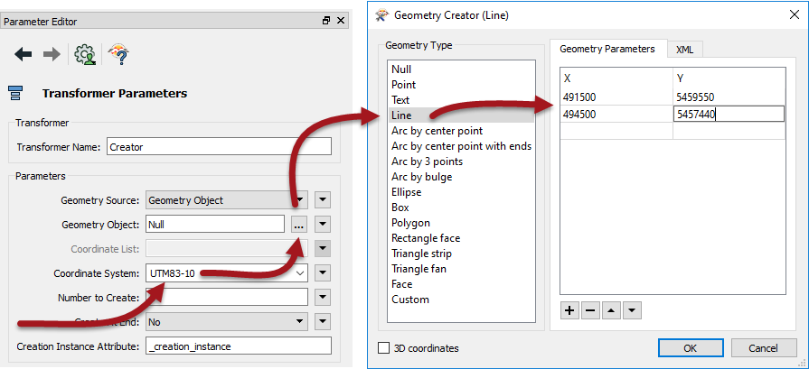

Click the OK button to close the dialog and the Accept/OK button to confirm the changes.

 **6) Check ShortestPathFinder Parameters**
 The coordinates of the feature we've added might not sit exactly on the road network. To get around this issue there are parameters we can use in the ShortestPathFinder.

So, inspect the ShortestPathFinder parameters. Under Snap Options set **From-To and Network Snapping** to *Yes* and enter *150* as the **Snapping Tolerance**:

Also notice that there are parameters for network costs - we'll be making use of those later.

 **7) Run Workspace**
 Add some Inspector transformers after the ShortestPathFinder and run the workspace to prove it is working up to this point.

If all has gone well, the output will look like this, with a route defined:

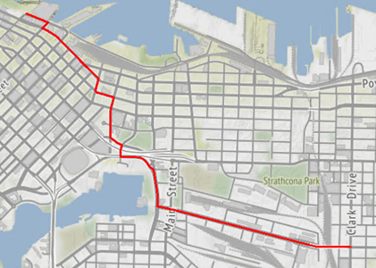
 Map tiles by <a href="http://stamen.com">Stamen Design</a>, under <a href="http://creativecommons.org/licenses/by/3.0">CC-BY-3.0</a>. Data by <a href="http://openstreetmap.org">OpenStreetMap</a>, under <a href="http://creativecommons.org/licenses/by-sa/3.0">CC-BY-SA</a>.

Of course, if all has not gone correctly, you must make use of Inspector and Logger transformers, plus Feature Debugging, to try and locate the error!

 **8) Add AttributeValueMapper**
 The result looks fine, but there are some things we are yet uncertain about: for example what if the route uses slower, residential roads? We can force the route to prefer arterial routes by applying a different cost to each road feature.

The cost will depend on the road type. In essence we are mapping road type to cost and the way to do that is with an AttributeValueMapper transformer.

So, add an AttributeValueMapper transformer to the workspace, between the CompleteRoads feature type and the ShortestPathFinder:Network port:

 **9) Edit AttributeValueMapper**
 Inspect the AttributeValueMapper's parameters. Enter the following values:

<table>
<tr><td style="font-weight: bold">Source Attribute</td><td align=center>roadtype</td></tr>
<tr><td style="font-weight: bold">Destination Attribute</td><td align=center>Cost</td></tr>
<tr><td style="font-weight: bold">Default Value</td><td align=center>2</td></tr>
</table>

Now, underneath those parameters, we'll map some data.

<table>
<tr><th>Source Value</th><th>Destination Value</th></tr>
<tr><td>Arterial</td><td align=center>1</td></tr>
<tr><td>Residential</td><td align=center>3</td></tr>
</table>

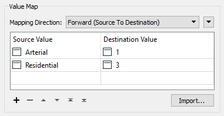

Basically, if the route is arterial (a main road) it will get a cost of 1; residential routes will get a cost of 3 and all other types will get a cost of 2 (because that's the default value). Click Accept/OK to confirm the parameters.

 **10) Apply Costs**
 Now we have to apply the costs we have just created. Inspect the ShortestPathFinder's parameters. Enter the following values:

<table>
<tr><td style="font-weight: bold">Cost Type</td><td align=center>By Two Attributes</td></tr>
<tr><td style="font-weight: bold">Forward Cost Attribute</td><td align=center>Cost</td></tr>
<tr><td style="font-weight: bold">Reverse Cost Attribute</td><td align=center>Cost</td></tr>
</table>

---

<!--Tip Section--> 

<table style="border-spacing: 0px">
<tr>
<td style="vertical-align:middle;background-color:darkorange;border: 2px solid darkorange">
<i class="fa fa-info-circle fa-lg fa-pull-left fa-fw" style="color:white;padding-right: 12px;vertical-align:text-top"></i>
TIP
</td>
</tr>

<tr>
<td style="border: 1px solid darkorange">

Why "Two Attributes"? That's because with only a forward cost, I could only ever travel along a stretch of road in the same direction as the vertices are arranged in. Since I don't want to avoid roads based on their vertex direction, using two attributes tells FME the cost is the same in both directions.

</td>
</tr>
</table>

---

Now re-run the workspace to see if there is any difference in the result. It should look like this:

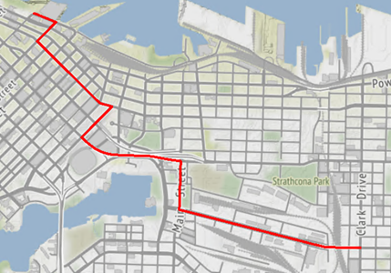
 Map tiles by <a href="http://stamen.com">Stamen Design</a>, under <a href="http://creativecommons.org/licenses/by/3.0">CC-BY-3.0</a>. Data by <a href="http://openstreetmap.org">OpenStreetMap</a>, under <a href="http://creativecommons.org/licenses/by-sa/3.0">CC-BY-SA</a>.

So the cost weighting has obviously made a difference. But there is a problem with this result...

---

<!--Person X Says Section-->

<table style="border-spacing: 0px">
<tr>
<td style="vertical-align:middle;background-color:darkorange;border: 2px solid darkorange">
<i class="fa fa-quote-left fa-lg fa-pull-left fa-fw" style="color:white;padding-right: 12px;vertical-align:text-top"></i>
Ms. Analyst says...
</td>
</tr>

<tr>
<td style="border: 1px solid darkorange">

The route is taking a longer path this time, and I can see a reason why that might be: cost is being used to weight routes <strong>instead</strong> of the distance, not as well as. 
  To explain this, let's say I want to travel from A to B. There is a single residential road feature that starts at A and ends at B, with a route distance of 1.5 kilometres. 
  There is also a single arterial road feature that starts at A and ends at B. Rather extremely, it loops around the dark side of the moon with a route distance of 768,000 kilometres. 
  Currently our solution would choose the 768,000 kilometre trip, because it has a cost of "1" compared to the residential route cost of "3"!
  Plainly the exercise data here is nowhere near as ridiculous, but it's equally plain that the route might not be the optimum until distance is factored back into the result. 

</td>
</tr>
</table>

---

 **11) Add AttributeManager**
 Add an AttributeManager transformer between the AttributeValueMapper:Output port and the ShortestPathFinder:Network port and view the parameters.

In the value field for the Cost attribute, click the dropdown arrow and select Open Arithmetic Editor. In that dialog enter the expression:

<pre>
@Value(Cost)*@Length()
</pre>

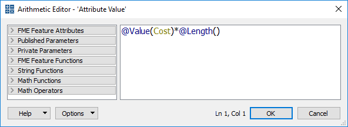

In short, we're now multiplying cost by road length to give us a combined weighting.

Re-run the translation to see if it makes a difference:

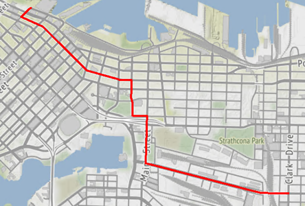
 Map tiles by <a href="http://stamen.com">Stamen Design</a>, under <a href="http://creativecommons.org/licenses/by/3.0">CC-BY-3.0</a>. Data by <a href="http://openstreetmap.org">OpenStreetMap</a>, under <a href="http://creativecommons.org/licenses/by-sa/3.0">CC-BY-SA</a>.

Yes, it does, proving that the route was longer than it could be. Of course, the expression we've used is again very subjective, and could be made more complex to give a better result (we could try a logarithmic scale to see what that produced).

 **12) Edit AttributeManager**
 Regardless of our expression, there's another last snag to cover... one-way streets. Currently we have no solution in place to prevent us driving the wrong direction.

Luckily each one-way street is flagged with an attribute, and has its vertices ordered in the direction of permitted travel, so we know which way to avoid. Let's use this information to solve that problem.

We'll need to calculate different cost attributes for each direction now, although the value will only differ when a one-way street is involved. There are - as usual - multiple ways to handle this in FME; let's go with a moderately easy one.

View the AttributeManager parameters again. This time create a new Output Attribute called ReverseCost. In the value field click the drop down arrow and choose Conditional Value.

---

<!--Tip Section--> 

<table style="border-spacing: 0px">
<tr>
<td style="vertical-align:middle;background-color:darkorange;border: 2px solid darkorange">
<i class="fa fa-info-circle fa-lg fa-pull-left fa-fw" style="color:white;padding-right: 12px;vertical-align:text-top"></i>
TIP
</td>
</tr>

<tr>
<td style="border: 1px solid darkorange">

Conditional Values are those that are set dependent on a test condition. It's like incorporating a Tester into the AttributeManager. These are covered in more detail in the FME Desktop Advanced training course.

</td>
</tr>
</table>

---

In the definition dialog that opens, double-click in the first "If" row and a Test Condition dialog opens. In here set up a test for oneway = Y. For the Output Value (bottom of the dialog) enter the value 9999 (i.e. the cost of travelling the wrong way is *really* expensive)!

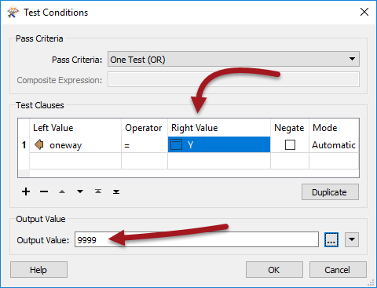

Click OK to close that dialog. Back in the previous dialog, double-click where it says &lt;No Action&gt; choose the dropdown arrow and select the attribute Cost:

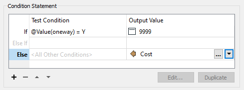

Click OK again twice more to close these dialogs. 

What we've essentially done is say that if this is a one-way street, set a prohibitively high reverse cost, otherwise just set the usual forward cost.

 **13) Apply Cost**
 One last change. Check the ShortestPathFinder parameters and change the ReverseCost attribute from Cost to ReverseCost:

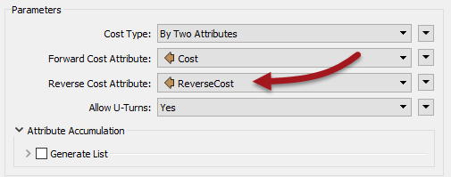

Now we're ready to go. Re-run the workspace and check the output:

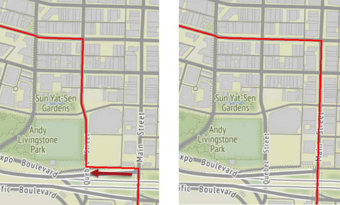

There is at least one change (above) caused by a route that previously travelled the wrong-way along a one-way street!

 **14) Connect Schema**
 Oh! Don't forget to remove the Inspector transformers and connect the Path port to the Route output feature type:

Now run the workspace, upload the data to your GPS device, and you are ready to go!

---

<!--Advanced Exercise Section-->

<table style="border-spacing: 0px">
<tr>
<td style="vertical-align:middle;background-color:darkorange;border: 2px solid darkorange">
<i class="fa fa-cogs fa-lg fa-pull-left fa-fw" style="color:white;padding-right: 12px;vertical-align:text-top"></i>
Advanced Exercise
</td>
</tr>

<tr>
<td style="border: 1px solid darkorange">

Not really advanced, but you did use Best Practice throughout, right? I mean, you have bookmarks and annotations where needed, and no overlapping connections? If not, well you might want to fix that!

</td>
</tr>
</table>

---

<!--Exercise Congratulations Section--> 

<table style="border-spacing: 0px">
<tr>
<td style="vertical-align:middle;background-color:darkorange;border: 2px solid darkorange">
<i class="fa fa-thumbs-o-up fa-lg fa-pull-left fa-fw" style="color:white;padding-right: 12px;vertical-align:text-top"></i>
CONGRATULATIONS
</td>
</tr>

<tr>
<td style="border: 1px solid darkorange">

By completing this exercise you proved you know how to:
 
<ul><li>Create and use an FME database connection</li>
<li>Create a prototype FME workspace using a variety of transformers</li>
<li>Use debugging techniques to find any problems encountered in an exercise</li>
<li>Use a good style for developing workspaces</li></ul>

</td>
</tr>
</table>