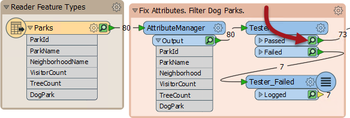

<!-- Add details about run with caching and the popup buttons-->

## Integrated Inspection ##

When developing and testing a workspace, it's necessary to inspect the data being produced on a regular basis. There are various methods to send data directly to a data inspection window.

### Redirect to Inspector ###

The simplest method to see output before it is written is to use the Redirect to FME Data Inspector option:

In this scenario all data is sent to the Data Inspector instead of being written; no output is produced, and the data can be checked for flaws before writing.

### Inspector Transformers ###

In most cases it's necessary to inspect data at certain points in a workspace - not at the very end - and this can be done with Inspector transformers:

For example here the author has attached Inspectors to three different transformers.

### Feature Caching ###

Sometimes it's important to be able to inspect data at any step of the translation. Adding an Inspector transformer at every step would be tiresome, so instead FME has an option to cache data automatically.

This behavior is activated using Run &gt; Run with Feature Caching on the menubar:

With this option active, FME generates caches at every step of the translation when the workspace is run:

The caches are indicated by the small icons on each object. In the above screenshot, the caches are green, but they can change to yellow or red depending on how fresh the data is.

---

### Inspecting Cached Data ###

Cached data can be inspected by clicking on the icon on a particular object.

---

<!--Tip Section-->

<table style="border-spacing: 0px">
<tr>
<td style="vertical-align:middle;background-color:darkorange;border: 2px solid darkorange">
<i class="fa fa-info-circle fa-lg fa-pull-left fa-fw" style="color:white;padding-right: 12px;vertical-align:text-top"></i>
TIP
</td>
</tr>

<tr>
<td style="border: 1px solid darkorange">

It's certainly quicker to set up "Run with Data Caching" than to manually add Inspector transformers. However, be aware that caching data obviously causes the translation to be slower, and to use system resources such as disk space.
  Data caching is very useful while developing a workspace, but should be turned off before putting a workspace into production.

</td>
</tr>
</table>
