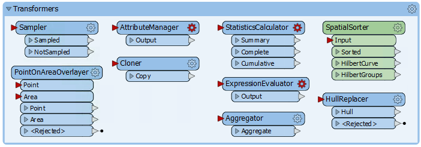
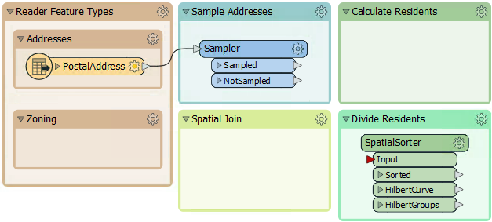
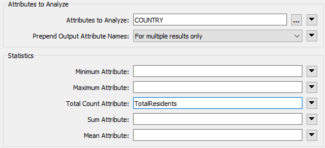
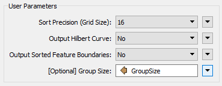
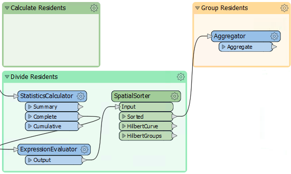

<!--Exercise Section-->

<table style="border-spacing: 0px;border-collapse: collapse;font-family:serif">
<tr>
<td width=25% style="vertical-align:middle;background-color:darkorange;border: 2px solid darkorange">
<i class="fa fa-cogs fa-lg fa-pull-left fa-fw" style="color:white;padding-right: 12px;vertical-align:text-top"></i>
Exercise 1
</td>
<td style="border: 2px solid darkorange;background-color:darkorange;color:white">
Residential Garbage Collection Zones
</td>
</tr>

<tr>
<td style="border: 1px solid darkorange; font-weight: bold">Data</td>
<td style="border: 1px solid darkorange">Addresses (Esri Geodatabase), Zones (MapInfo TAB)</td>
</tr>

<tr>
<td style="border: 1px solid darkorange; font-weight: bold">Overall Goal</td>
<td style="border: 1px solid darkorange">Create boundaries for residential garbage collection</td>
</tr>

<tr>
<td style="border: 1px solid darkorange; font-weight: bold">Demonstrates</td>
<td style="border: 1px solid darkorange">Workspace prototyping</td>
</tr>

<tr>
<td style="border: 1px solid darkorange; font-weight: bold">Start Workspace</td>
<td style="border: 1px solid darkorange">C:\FMEData2019\Workspaces\DesktopBasic\Design-Ex1-Begin.fmw</td>
</tr>

<tr>
<td style="border: 1px solid darkorange; font-weight: bold">End Workspace</td>
<td style="border: 1px solid darkorange">C:\FMEData2019\Workspaces\DesktopBasic\Design-Ex1-Complete.fmw</td>
</tr>

</table>

The city maintenance department has a dataset of garbage collection schedules, to assign residents to a collection on a particular day:

However, because of shifting demographics and zoning changes, they have decided that new boundaries should be drawn.

Your task is to use FME to create new boundaries. You must create five polygons, adjacent to each other, and with approximately the same number of residents in each. The analysis will be based on the city's address database. An estimate of the number of residents per address will be created depending on the zone type it falls within:

- Single-family residences: 2 adults
- Two-family residences: 4 adults
- Multi-family residences: 12 adults
- Comprehensive development zone: 8 adults
- Commercial properties: 1 adult

The output format shall be OGC GeoPackage.

To develop this workspace, it's necessary to consider what different steps might be required. We can then create sections with a bookmark and fill them in as we go along.

---

 **1) Plan Workspace**
 Let's plan this workspace together.

We need to read the address data (or a sample of it) and write the output to OGC GeoPackage. We need to know what zone type each address falls inside, which needs zoning data and a transformer to carry out a spatial join.

We also need to create a resident count based on the zone type and then divide the residents into five different areas. Finally, we need to group the addresses with a boundary shape around them.

In short, we need this set of actions:

- Read/Sample Address database
- Read Zoning data
- Create a spatial join
- Calculate resident count
- Divide residents into five groups
- Aggregate the addresses into their group
- Create a boundary shape
- Write OGC GeoPackage

So, choose File &gt; Open and select the beginning workspace (C:\FMEData2019\Workspaces\DesktopBasic\Design-Ex1-Begin.fmw). It already has a set of bookmarks to represent these steps to be carried out but, as yet, we can't be sure which sections will be larger, so all bookmarks are the same size:

You'll also find a bookmark containing all of the transformers required for the exercise:

Or at least, these are the transformers we think will be required for the exercise!

 **2) Sample Source Data**
 There are more features in the address database than we need for workspace construction and testing, so let's reduce that to a smaller sample.

Rather than create a test dataset, here we'll use a Sampler transformer. There is a Sampler transformer in the "Transformers" bookmark, so simply move that transformer into the "Sample Addresses" bookmark and connect the PostalAddress feature type to it:

Inspect the Sampler's parameters. Set it to sample every 25th feature

Run the workspace to be sure it is sampling the data correctly. Click on the magnifying glass on the Sampler:Sampled output port to view the data in the Visual Preview window. Out of 13,597 addresses, there should be 543 selected for use.

 **3) Divide Data into Groups**
 Before trying to add the Zoning dataset into the workspace, let's try and create groups from the basic dataset. We can do this with a custom transformer from the FME Hub, called the SpatialSorter.

So move the SpatialSorter from the "Transformers" bookmark to the "Divide Residents" bookmark:

The SpatialSorter sorts data spatially (so features closer geographically become closer in the sorted output) and creates groups.

Check the parameters for this transformer. Notice that the group parameter asks for group size, not the number of groups. Therefore we'll need to calculate how many addresses there are when split into five groups.

 **4) Calculate Group Sizes**
 To calculate the number of addresses per group, we need the number of addresses and then divide that by five. We can do this with a combination of StatisticsCalculator and ExpressionEvaluator.

So, enlarge the Divide Residents bookmark as required and move the StatisticsCalculator and ExpressionEvaluator transformers from the "Transformers" bookmark. Connect them up to the Sampler:Sampled port like so:

 **5) Calculate Group Sizes**
 Inspect the parameters for the StatisticsCalculator. This transformer will tell us how many features there are (the Total Count). Pick an attribute for the Attributes to Analyze parameter. Because we only want to count features not create true statistics, it can be any attribute you like.

Under the Total Count Attribute parameter, enter the name TotalResidents. Erase the rest of the calculated attribute fields, so they are not calculated:

In the ExpressionEvaluator, enter GroupSize in the New Attribute parameter. In the Arithmetic Expression field enter the expression:

    @ceil((@Value(TotalResidents)/5))

The simplest way is to double-click the ceil function to add it, then double-click the TotalResidents attribute, and manually add the /5 part.

This expression will divide the number of residents into five groups, rounding up. The rounding up part is essential, and it's what the ceil function does.

Run the translation and view the ExpressionEvaluator output in the Visual Preview window to provide that this part works. The TotalResidents should be 543 and the GroupSize should be 109 for each feature.

 **6) Group Residents**
 Now inspect the parameters for the SpatialSorter once more. We will leave Grid Size at 16 for now; this will give us a more coarse result but will run faster while we develop the workspace. Under the Group Size parameter, click the drop-down arrow and select Attribute Value &gt; GroupSize:

This sets the group size to the attribute just calculated.

To create groups of addresses, move the Aggregator transformer to the "Group Residents" bookmark, and connect it to the SpatialSorter:Sorted output port:

Inspect the parameters for the Aggregator. Set the Group By parameter to the GroupID attribute (in other words, aggregate features together in the groups created by the SpatialSorter):

Using an Inspector transformer we can also set the Group By parameter, which will result in the data being represented with different colors for each group in the Visual Preview window. Connect an Inspector to the Aggregator:Aggregate output port and then in the parameters set the Group By to GroupID. Run the translation, and you should find there are five sets of point aggregates in the output, each of which has approximately the same number of point features:

---

<!--Tip Section-->

<table style="border-spacing: 0px">
<tr>
<td style="vertical-align:middle;background-color:darkorange;border: 2px solid darkorange">
<i class="fa fa-info-circle fa-lg fa-pull-left fa-fw" style="color:white;padding-right: 12px;vertical-align:text-top"></i>
TIP
</td>
</tr>

<tr>
<td style="border: 1px solid darkorange">

The Inspector transformer can be used to inspect data, but with Visual Preview and feature caching there isn't much reason to use it often. This case, where you want to add a group-by to help visualize your data in groups, is one of the cases where this transformer is useful.

You can change the color of the groups by clicking on the Toggle Display Control button on the left-hand side of visual preview. Then double-click on the four square icon to open the Geometry Drawing Styles dialog, where you can set the color. When the color is manually set, the four square icon will display the color.

 

</td>
</tr>
</table>

---

Save the workspace, naming it GarbageCollection.fmw or something similar. Ideally, the name would include a version number (like GarbageCollection-v1.fmw), but it's not necessary for this exercise.

The next step in the workspace will be to add in the Zoning data, create a spatial join, and calculate how many residents live in each property based on each address' zoning type.

---

<!--Exercise Congratulations Section-->

<table style="border-spacing: 0px">
<tr>
<td style="vertical-align:middle;background-color:darkorange;border: 2px solid darkorange">
<i class="fa fa-thumbs-o-up fa-lg fa-pull-left fa-fw" style="color:white;padding-right: 12px;vertical-align:text-top"></i>
CONGRATULATIONS
</td>
</tr>

<tr>
<td style="border: 1px solid darkorange">

By completing this exercise you have learned how to:
 
<ul><li>Plan a workspace development</li>
<li>Create a workspace, section by section</li>
<li>Restrict source data to a small sample</li>
<li>Use a custom transformer from the FME Hub</li>
<li>Carry out an arithmetic calculation</li>
<li>Aggregate data into groups</li>
<li>Save a workspace with a version number</li></ul>

</td>
</tr>
</table>
