<!--Exercise Section-->

<table style="border-spacing: 0px;border-collapse: collapse;font-family:serif">
<tr>
<td width=25% style="vertical-align:middle;background-color:darkorange;border: 2px solid darkorange">
<i class="fa fa-cogs fa-lg fa-pull-left fa-fw" style="color:white;padding-right: 12px;vertical-align:text-top"></i>
Exercise 2
</td>
<td style="border: 2px solid darkorange;background-color:darkorange;color:white">
Residential Garbage Collection Zones
</td>
</tr>

<tr>
<td style="border: 1px solid darkorange; font-weight: bold">Data</td>
<td style="border: 1px solid darkorange">Addresses (Esri Geodatabase), Zones (MapInfo TAB)</td>
</tr>

<tr>
<td style="border: 1px solid darkorange; font-weight: bold">Overall Goal</td>
<td style="border: 1px solid darkorange">Create boundaries for residential garbage collection</td>
</tr>

<tr>
<td style="border: 1px solid darkorange; font-weight: bold">Demonstrates</td>
<td style="border: 1px solid darkorange">Readers and Writers</td>
</tr>

<tr>
<td style="border: 1px solid darkorange; font-weight: bold">Start Workspace</td>
<td style="border: 1px solid darkorange">C:\FMEData2019\Workspaces\DesktopBasic\Design-Ex2-Begin.fmw</td>
</tr>

<tr>
<td style="border: 1px solid darkorange; font-weight: bold">End Workspace</td>
<td style="border: 1px solid darkorange">C:\FMEData2019\Workspaces\DesktopBasic\Design-Ex2-Complete.fmw</td>
</tr>

</table>

Here we continue with a project to redefine garbage collection schedules.

In the first exercise, we used various transformers to divide addresses into five separate groups. Now the task is to refine that work by estimating the number of residents per address based on the zone type it falls within:

- Single-family residences: 2 adults
- Two-family residences: 4 adults
- Multi-family residences: 12 adults
- Comprehensive development zone: 8 adults
- Commercial properties: 1 adult

---

 **1) Open Workspace**
 Open your workspace from the previous exercise.

If you gave that workspace a version number in its name, then you should make a copy of the workspace with a new version number. For example, if you saved it to GarbageCollection-v1.fmw then make a copy named GarbageCollection-v2.fmw and open that for editing.

Alternatively you can open the workspace C:\FMEData2019\Workspaces\DesktopBasic\Design-Ex2-Begin.fmw:

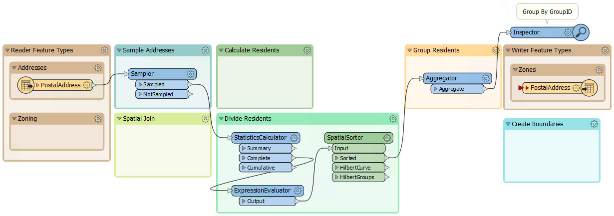

The remaining transformers in the "Transformers" bookmark are these:

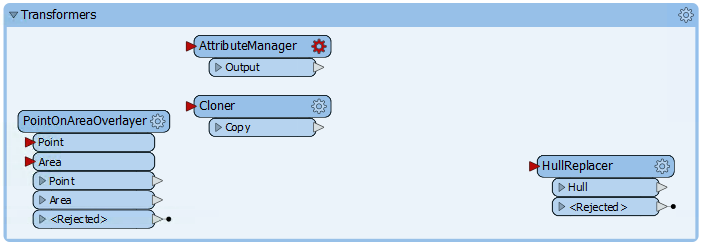

 **2) Add Reader**
 The first task here is to identify which planning zone each address falls inside. We need to read the zoning data and carry out a spatial join. To read a new dataset of data in a different format requires a new reader.

So, select Readers &gt; Add Reader from the menu bar. When prompted enter the following parameters:

<table style="border: 0px">

<tr>
<td style="font-weight: bold">Reader Format</td>
<td style="">MapInfo TAB (MITAB)</td>
</tr>

<tr>
<td style="font-weight: bold">Reader Dataset</td>
<td style="">C:\FMEData2019\Data\Zoning\Zones.tab</td>
</tr>

</table>

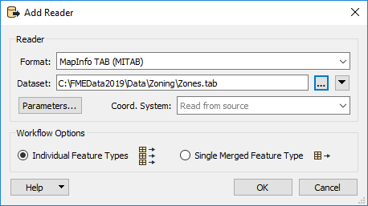

A reader is added to the Navigator window and a feature type to the canvas. Move the feature type into the Zoning bookmark:

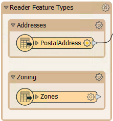

 **3) Create Spatial Join**
 To carry out a spatial join we'll use a PointOnAreaOverlayer transformer; this is a type of join called Point-in-Polygon.

So, move the PointOnAreaOverlayer transformer from the "Transformers" bookmark to the "Spatial Join" bookmark. Connect the newly added Zoning data to the Area port and the output from the Sampler to the Point port:

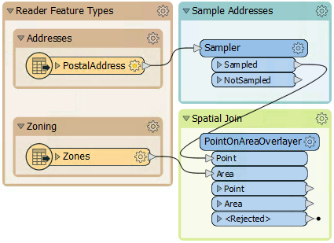

Inspect the PointOnAreaOverlayer parameters. Expand the Attribute Accumulation section and put a check mark against Merge Attributes:

This transformer is the first we've used that has a live &lt;Rejected&gt; port. For now, we'll leave it to stop the translation, since during testing we want to know about anything that causes a failure of the transformer.

Run the translation, ignore the Invalid Transformer Parameters dialog that pops up and click Run. This dialog pops up because we have previously run the translation to the Aggregator, but now we have broken that connection. We will fix it shortly.

Click on the PointOnAreaOverlayer:Point output port to view the data in the Visual Preview window. View both the Graphics and Table view. The overlay and attribute merging should cause each address to be given a zone name and category, click on any of the zones to confirm this.

 **4) Calculate Residents**
 The next step is to set how many residents live at a certain address according to its zoning type.

We know that:

<table>
<tr><th align="center">Zone Begins With</th><th align="center">Zone Type</th><th align="center">Residents</th></tr>
<tr><td align="center">RS</td><td align="center">Single Family</td><td align="center">2</td></tr>
<tr><td align="center">RT</td><td align="center">Two Family</td><td align="center">4</td></tr>
<tr><td align="center">RM</td><td align="center">Multiple Family</td><td align="center">12</td></tr>
<tr><td align="center">CD</td><td align="center">Comprehensive</td><td align="center">8</td></tr>
<tr><td align="center">C</td><td align="center">Commercial</td><td align="center">1</td></tr>
</table>

For example, zones RS-1, RS-2, RS-3 are all single-family zones, and we assume a total of two adults per address. This assumption makes it slightly more complicated because we need to match a zone type using a "begins with" string comparison.

This match can be done using an AttributeManager with **Conditional Values**.

This step is slightly complex, but luckily the AttributeManager inside the "Transformers" bookmark is already set up for this purpose. So move the AttributeManager into the "Calculate Residents" bookmark and connect it to the PointOnAreaOverlayer:Point output port:

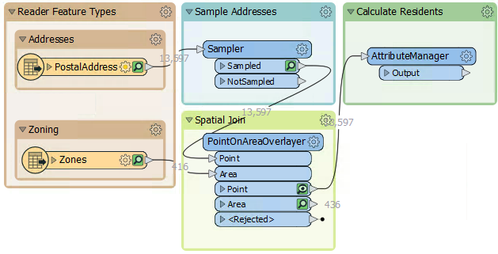

If you are interested in what Conditional Values look like, open the parameters dialog for the AttributeManager and click the drop-down arrow in the Attribute Value field for the Persons attribute. Choose Conditional Value:

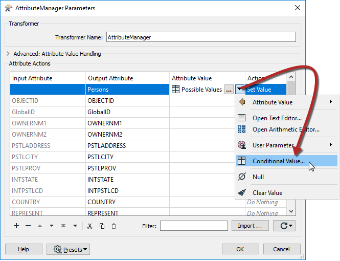

Doing so opens a Tester-like dialog with multiple conditions that test for each zone type, and an attribute value to set them to:

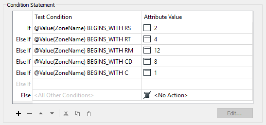

---

<!--Tip Section-->

<table style="border-spacing: 0px">
<tr>
<td style="vertical-align:middle;background-color:darkorange;border: 2px solid darkorange">
<i class="fa fa-info-circle fa-lg fa-pull-left fa-fw" style="color:white;padding-right: 12px;vertical-align:text-top"></i>
TIP
</td>
</tr>

<tr>
<td style="border: 1px solid darkorange">

If you want to challenge yourself, try adding a blank AttributeManager instead of moving the existing one. Then create the conditional statements to match the image above.

</td>
</tr>
</table>

---

 **5) Create Residents**
 We now know (or have approximated) the number of residents per address. However, we must use that number in a way that will affect the output. The simplest way to do this is to create multiple copies of each address, one for each resident.

For example, for an address with eight residents, we'll create eight address points.

We can do this very simply with a Cloner transformer. So, move the Cloner transformer from the "Transformers" bookmark to the "Calculate Residents" bookmark. Connect the AttributeManager to the Cloner's input and its output to the StatisticsCalculator:

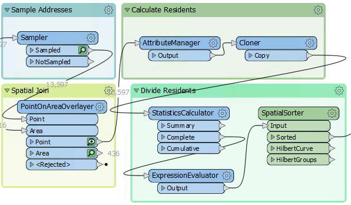

Inspect the Cloner parameters. For the Number of Copies parameter, click the drop-down arrow and choose Attribute Value &gt; Persons:

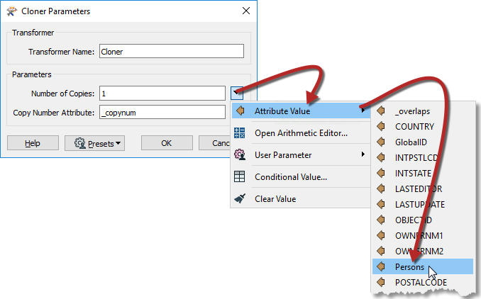

Doing so will create *&lt;Persons&gt;* copies of the original addresses (note that the transformer doesn't output the original as well, so the output is *&lt;Persons&gt;* features, not *&lt;Persons&gt;+1*).

 **6) Run Translation**
 Make sure an Inspector is still attached to the Aggregator transformer and run the translation. The translation will fail with the error message:

    Cloner_&lt;Rejected&gt;: Termination Message: 'Cloner output a &lt;Rejected&gt; feature.'

The translation failed because addresses without a resident (for example, Industrial) have no Persons attribute and are being rejected by the Cloner transformer. The &lt;Rejected&gt; port is still set up to stop the translation, and so we get this error.

There are various choices to handle this. We could:

1. Change the Workspace parameter **Rejected Feature Handling** to *Continue Translation*
2. Add a transformer to handle the Cloner's rejected features
3. Set the Conditional Values to give a value of zero, instead of not including a value at all

Setting the Conditional Values would be the best solution to deal with the problem directly. But there might be other causes for rejected data, and we want to deal with that without having the translation stopped.

Setting the Rejected Feature Handling parameter means all &lt;Rejected&gt; ports would ignore rejected output. This setting might be useful in a production workspace, but in testing, we would probably want to stop the translation so that we can be aware of issues immediately.

So for us, the better solution is to add a transformer to the Cloner &lt;Rejected&gt; port. We don't need to inspect or log these features because we know that they will exist. So connect the &lt;Rejected&gt; port to a small transformer called a Junction:

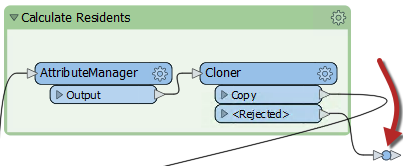

This Junction will handle the rejected output, but quietly drop it without further fuss.

Re-run the translation. The output should be five groups of point feature again, but in a different pattern to the end of the previous exercise:

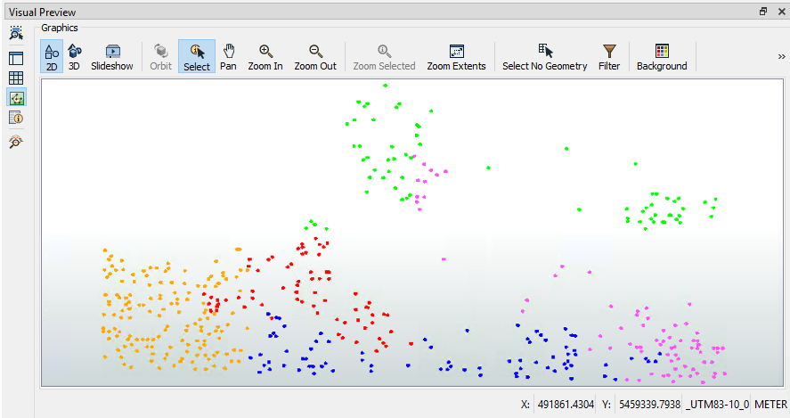

 **7) Write Output**
 Now to write some output. The simplest method is to connect the Aggregator output to the PostalAddress output feature type and re-run the workspace.

However, it would also be useful to rename the output feature type and remove all of its attributes, since they are from the reader dataset and don't apply here. So open the writer feature type parameters dialog. In the Parameters tab rename the feature type to GarbageZones. In the User Attributes tab, remove all of the attributes that are being written:

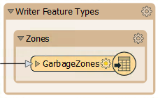

Also, we should change the GeoPackage writer parameter Overwrite Database to overwrite the database each time we run the workspace. To do this, find the GarbageZones \[GEOPACKAGE\] reader in the Navigator, expand the Parameters, double-click Overwrite Database, and then check the box and click Ok:

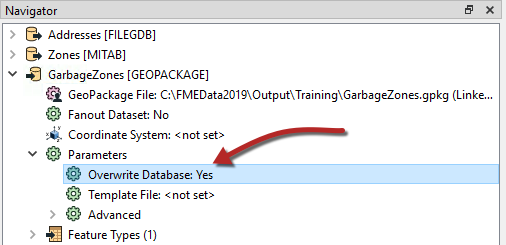

That way we don't accumulate more and more results in the same dataset.

---

<!--Exercise Congratulations Section-->

<table style="border-spacing: 0px">
<tr>
<td style="vertical-align:middle;background-color:darkorange;border: 2px solid darkorange">
<i class="fa fa-thumbs-o-up fa-lg fa-pull-left fa-fw" style="color:white;padding-right: 12px;vertical-align:text-top"></i>
CONGRATULATIONS
</td>
</tr>

<tr>
<td style="border: 1px solid darkorange">

By completing this exercise you have learned how to:
 
<ul><li>Add a reader to a workspace</li>
<li>Carry out a point-in-polygon spatial join</li>
<li>Set conditional values in an AttributeManager transformer</li>
<li>Use a Cloner transformer to create multiple copies of data</li>
<li>Manage rejected features</li></ul>

</td>
</tr>
</table>
