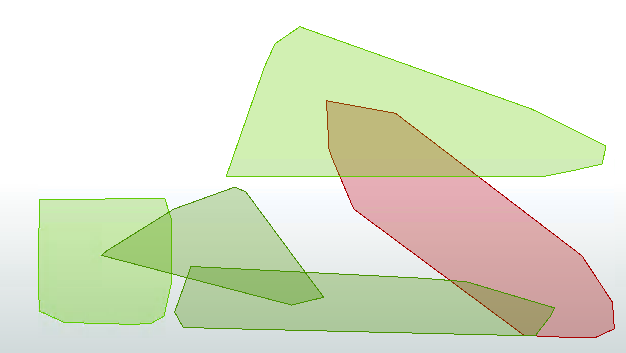
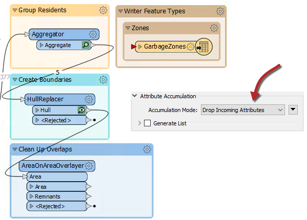
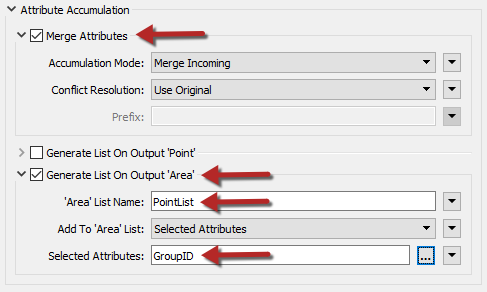

<!--Exercise Section-->

<table style="border-spacing: 0px;border-collapse: collapse;font-family:serif">
<tr>
<td width=25% style="vertical-align:middle;background-color:darkorange;border: 2px solid darkorange">
<i class="fa fa-cogs fa-lg fa-pull-left fa-fw" style="color:white;padding-right: 12px;vertical-align:text-top"></i>
Exercise 3
</td>
<td style="border: 2px solid darkorange;background-color:darkorange;color:white">
Residential Garbage Collection Zones
</td>
</tr>

<tr>
<td style="border: 1px solid darkorange; font-weight: bold">Data</td>
<td style="border: 1px solid darkorange">Addresses (Esri Geodatabase), Zones (MapInfo TAB)</td>
</tr>

<tr>
<td style="border: 1px solid darkorange; font-weight: bold">Overall Goal</td>
<td style="border: 1px solid darkorange">Create boundaries for residential garbage collection</td>
</tr>

<tr>
<td style="border: 1px solid darkorange; font-weight: bold">Demonstrates</td>
<td style="border: 1px solid darkorange">Readers and Writers</td>
</tr>

<tr>
<td style="border: 1px solid darkorange; font-weight: bold">Start Workspace</td>
<td style="border: 1px solid darkorange">C:\FMEData2018\Workspaces\DesktopBasic\Design-Ex3-Begin.fmw</td>
</tr>

<tr>
<td style="border: 1px solid darkorange; font-weight: bold">End Workspace</td>
<td style="border: 1px solid darkorange">C:\FMEData2018\Workspaces\DesktopBasic\Design-Ex3-Complete.fmw</td>
</tr>

</table>

Here we continue on with a project to redefine garbage collection schedules. 

In the first two exercises we used various transformers to divide addresses into five separate groups, according to zoning type. Then we wrote the data to Geopackage and (optionally) replaced the reader/writer with a FeatureReader/FeatureWriter transformer.

Now the task is simply to replace the groups of point features with a polygon boundary. 

 **1) Open Copy of Workspace**
 Make a copy of your original workspace and give it a new version number. For example, if you saved it to GarbageCollection-v2.fmw then make a copy named GarbageCollection-v3.fmw

The idea is that we want to keep prior versions as a checkpoint, in case we need to revert at any point.

Open the new version in Workbench, ready for editing.

 **2) Run Workspace**
 Turn on feature caching using Run &gt; Run with Feature Caching on the menubar.

Now re-run the workspace. The process will take a little longer than the normal translation time, as caches are being created and filled. Take a note of the time taken (1 minute 7 seconds on my machine).

Once complete, click on some caches to prove that the data can be inspected directly in the FME Data Inspector.

 **3) Add HullReplacer**
 Add a HullReplacer transformer and move it into the Create Boundaries bookmark. Connect it between the Aggregator and FeatureWriter:

Notice how the HullReplacer has no cache, because it is newly placed.

 **4) Re-Run Workspace**
 Now let's re-run the workspace. But rather than run the whole translation, click on the HullReplacer transformer and on the icons that pop up, click Run from This:

Notice how hovering shows what parts of the workspace will be run. The translation this time should take less than one second, since the results of prior parts of the workspace are already stored in a cache.

The output now includes polygons, to prove that the translation has functioned correctly:

 **5) Clean Up Overlaps**
 The problem with the output is that all of the polygons overlap to some extent. That needs to be fixed so that there are no overlaps. What's more, we should check to which zone an overlap belongs by seeing which group most of its addresses belong to.

Because this is unexpected, we don't have an area of the workspace set aside yet. So add a new bookmark (or simply move the now-empty Transformers bookmark) and name it Clean Up Overlaps:

 **6) Add AreaOnAreaOverlayer**
 Overlaps can be dissected using the AreaOnAreaOverlayer transformer, so add one of these to the new bookmark, connected to the HullReplacer transformer. Check the parameters and set the **Attribute Accumulation Mode** to *Drop Incoming Attributes*.

Re-run the translation by clicking the AreaOnAreaOverlayer and choosing Run From Here. There's no need to add an Inspector transformer because the data can be inspected by simply clicking on the Cache icon.

 **7) Add PointOnAreaOverlayer**
 The overlaps are dissolved, but we do not yet know which area to assign them to. It should be the one with most addresses; for example if an overlap contains 31 addresses from group one, and 52 addresses from group two, then it should be assigned to the group two polygon. 

We can start on this by using a PointOnAreaOverlayer. This will let us create a list of which addresses an overlap contains.

So add a PointOnAreaOverlayer transformer. The area features will be the output from the AreaOnAreaOverlayer. The point features will be a second connection from the SpatialSorter (i.e. the original points):

Inspect the parameters. Under Attribute Accumulation, set the following parameters:

<table>
<tr><td>Merge Attributes</td><td>Yes</td>
<tr><td>Generate List on Output 'Area'</td><td>Yes</td>
<tr><td>'Area' List Name</td><td>PointList</td>
<tr><td>Selected Attributes</td><td>GroupID</td>
</table>

This will create a list of all the point features that fall inside a polygon, with a record of their GroupID values. Confirm this works correctly by running the workspace at the new PointOnAreaOverlayer. Notice how the translation pulls data from two caches; the AreaOnAreaOverlayer and SpatialSorter transformers:

 **8) Add ListHistogrammer**
 To count the most frequent ID for records in a list we'll use the ListHistogrammer transformer.

---

<!--Tip Section--> 

<table style="border-spacing: 0px">
<tr>
<td style="vertical-align:middle;background-color:darkorange;border: 2px solid darkorange">
<i class="fa fa-info-circle fa-lg fa-pull-left fa-fw" style="color:white;padding-right: 12px;vertical-align:text-top"></i>
TIP
</td>
</tr>

<tr>
<td style="border: 1px solid darkorange">

This is not a commonly used transformer, so don't worry if you weren't aware of it, or if you are concerned about the large number of transformers available in FME. You will learn more about these transformers with practice. For now the ability to use partial runs is much more important. 

</td>
</tr>
</table>

---

Place a ListHistogrammer transformer connected to the PointOnAreaOverlayer:Area output port. Inspect the parameters and select PointList{}.GroupID as the source attribute:

Re-run the workspace (from the ListHistogrammer) to see the result of this transformer.

 **8) Add Dissolver**
 Finally let's add a Dissolver to merge the features together. So add a Dissolver connected to the ListHistogrammer output port:

Inspect the parameters. Under Group By select the attribute _histogram.value:

You'll be prompted for a value; this is which item in the list do we want. We want the first element because it has the most values, so this field should be set to zero (which it will be by default):

Re-run the workspace from the Dissolver and inspect the output:

We now have five polygon features to represent garbage collection areas, each with approximately the same number of residents. Connect the Dissolver:Area port to the writer feature type and this workspace is complete... nearly.

 **9) Remove Sampler**
 To complete the project let's run the workspace on the full dataset. You can do this either by deleting the Sampler transformer (the simplest solution) or disabling it and adding a connection to bypass it.

To bypass the Sampler, first draw a second connection from the source data to the first PointOnAreaOverlayer's Point input port:

Then right-click on the connection entering the Sampler input and disable it. Now this connection will be ignored. Running the workspace will bypass the Sampler, but leave the Sampler in place for possible later use.

Because this is the first time using the full dataset, we might consider caching this data too. However, that would make the workspace run much slower. So, for reasons of time and performance, turn off the Run with Caching option and then re-run the translation.

As expected, the result will look different, now that we're using the full dataset:

---

<!--Tip Section--> 

<table style="border-spacing: 0px">
<tr>
<td style="vertical-align:middle;background-color:darkorange;border: 2px solid darkorange">
<i class="fa fa-info-circle fa-lg fa-pull-left fa-fw" style="color:white;padding-right: 12px;vertical-align:text-top"></i>
TIP
</td>
</tr>

<tr>
<td style="border: 1px solid darkorange">

On my computer it takes four minutes to run the workspace with caching turned on. Without caching it only takes one minute.

</td>
</tr>
</table>

---

<!--Exercise Congratulations Section--> 

<table style="border-spacing: 0px">
<tr>
<td style="vertical-align:middle;background-color:darkorange;border: 2px solid darkorange">
<i class="fa fa-thumbs-o-up fa-lg fa-pull-left fa-fw" style="color:white;padding-right: 12px;vertical-align:text-top"></i>
CONGRATULATIONS
</td>
</tr>

<tr>
<td style="border: 1px solid darkorange">

By completing this exercise you have learned how to:
 
<ul><li>Turn on and use Feature Caching</li>
<li>Use new transformers: HullReplacer, ListHistogrammer, Dissolver</li>
<li>Bypass a transformer by disabling the connection to it</li></ul>

</td>
</tr>
</table>
