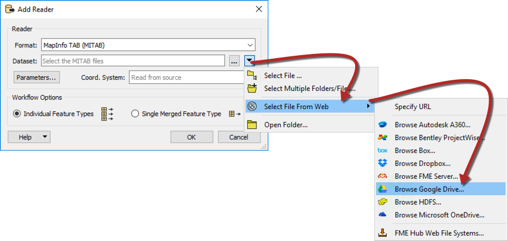
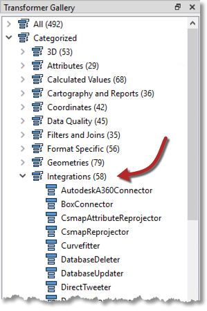

## Read/Write with Integration Transformers ##

Readers and FeatureReaders can both read data locally, with a database, or using a web service:

However, sometimes it's useful to be able to use a transformer to read (or write) to a web or other integrated service. There are various reasons, but a key one is to be able to read a file itself, rather than reading features from it; for example being able to extract a JPEG file from Dropbox and store it as an attribute (rather than reading it as an actual raster feature).

### Integration Transformers ###

There are multiple transformers in the Integrations category of the Transformer Gallery:

Some of these integration transformers are for reading, writing, or copying files, e.g.,:

<table style="width: 100%;">
<tr>
    <td style="border: 1px solid white; background-color:white; padding:2"><strong>&bull;</strong> AutodeskA360Connector</td>
    <td style="border: 1px solid white; background-color:white; padding:2"><strong>&bull;</strong> BoxConnector</td>
</tr>
<tr>
    <td style="border: 1px solid white; background-color:white; padding:2"><strong>&bull;</strong> DropboxConnector</td>
    <td style="border: 1px solid white; background-color:white; padding:2"><strong>&bull;</strong> FMEServerResourceConnector</td>
</tr>
<tr>
    <td style="border: 1px solid white; background-color:white; padding:2"><strong>&bull;</strong> GoogleDriveConnector</td>
    <td style="border: 1px solid white; background-color:white; padding:2"><strong>&bull;</strong> OneDriveConnector</td>
</tr>
<tr>
    <td style="border: 1px solid white; background-color:white; padding:2"><strong>&bull;</strong> S3Connector</td>
</tr>
</table>

In this example the author is reading a dataset of parks and passing the features to a DropboxConnector:

<!--There is no example workspace for this because it wouldn't work without a Dropbox connection-->

Each park feature has the name of a JPEG image that is stored in Dropbox. The DropboxConnector transformer is set up to read that image and store it as an attribute (ParkImage) on the feature.

The features are then sent to a PostGIS database - using a FeatureWriter transformer - where the ParkImage attribute is written to a binary (bytea) column.

---

<!--Tip Section-->

<table style="border-spacing: 0px">
<tr>
<td style="vertical-align:middle;background-color:darkorange;border: 2px solid darkorange">
<i class="fa fa-info-circle fa-lg fa-pull-left fa-fw" style="color:white;padding-right: 12px;vertical-align:text-top"></i>
TIP
</td>
</tr>

<tr>
<td style="border: 1px solid darkorange">

As well as fetching files from Dropbox, the DropboxConnector - as with most Connector transformers - is also capable of uploading content as a file.

</td>
</tr>
</table>
