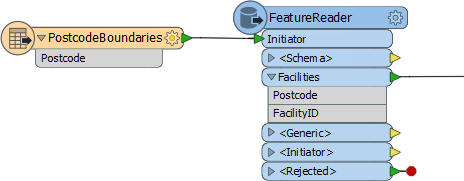

## Spatially Based Join Transformers ##
These are transformers that join data on the basis of a spatial relationship. There are many of these in FME Workbench, but the following are some of the key ones.

### Overlayers ###
There are a number of different "overlayer" transformers, each handling a different form of overlay. For example the PointOnAreaOverlayer carries out a spatial join on points that fall inside area (polygon) features. As the help explains, "Each point receives the attributes of the area(s) it is contained in, and each containing area receives the attributes of each point it contains."

Here the facility features are being provided with a postal code depending on which postal code polygon feature they fall inside.

The "_overlaps" attribute is another useful outcome of this transformer. It tells us how many polygons each facility fell inside; in this case it would be an easy way to spot the problem of a facility falling inside more than one postal code.

Conversely, the Area output would have an "_overlaps" attribute that would tell us how many facilities fell inside each postal code.

---
 
### NeighborFinder ###
The NeighborFinder transformer carries out a spatial join based on a proximity relationship. Here the NeighborFinder is being used to identify the closest fire hall to each facility:

The FireHallId and FireHallAddress attributes will be merged onto each Facility feature along with a number of useful attributes recording the X/Y coordinate, direction, and distance of the closest fire hall.

The parameters of the NeighborFinder includes the ability to specify a maximum distance for the relationship, or the maximum number of neighbors to find.

---

### FeatureReader ###
The FeatureReader is the spatial equivalent of the DatabaseJoiner transformer. It reads from an external dataset and forms a match based on a spatial relationship between the initiating feature and features in that dataset.

One difference is that the output is not the original feature, but the queried feature; hence the name FeatureReader.

For example, here the FeatureReader is being used to carry out the same overlay of facility and postal code. The Postcode features are read into the workspace and used as a means to spatially query facilities. The facilities are retrieved with the attributes of the postcode feature they fall inside. 

---

### SpatialFilter ###
The SpatialFilter - as its name suggests - filters data according to a spatial relationship. However, it does also merge attributes from one feature to another, therefore can be said to be a type of Spatial Join.

---

<!--Person X Says Section-->

<table style="border-spacing: 0px">
<tr>
<td style="vertical-align:middle;background-color:darkorange;border: 2px solid darkorange">
<i class="fa fa-quote-left fa-lg fa-pull-left fa-fw" style="color:white;padding-right: 12px;vertical-align:text-top"></i>
Miss Vector says...
</td>
</tr>

<tr>
<td style="border: 1px solid darkorange">

Here is a question on data joins. Look at the following screenshot, then answer how many features will appear in the output connection...
  
  <a href="http://52.73.3.37/fmedatastreaming/Manual/QAResponse2017.fmw?chapter=5&question=6&answer=1&DestDataset_TEXTLINE=C%3A%5CFMEOutput%5CQAResponse.html">1. Eight (8)</a>
 <a href="http://52.73.3.37/fmedatastreaming/Manual/QAResponse2017.fmw?chapter=5&question=6&answer=2&DestDataset_TEXTLINE=C%3A%5CFMEOutput%5CQAResponse.html">2. Eighteen (18)</a>
 <a href="http://52.73.3.37/fmedatastreaming/Manual/QAResponse2017.fmw?chapter=5&question=6&answer=3&DestDataset_TEXTLINE=C%3A%5CFMEOutput%5CQAResponse.html">3. Twenty-six (26)</a>
 <a href="http://52.73.3.37/fmedatastreaming/Manual/QAResponse2017.fmw?chapter=5&question=6&answer=4&DestDataset_TEXTLINE=C%3A%5CFMEOutput%5CQAResponse.html">4. Can't tell</a>

</td>
</tr>
</table>
