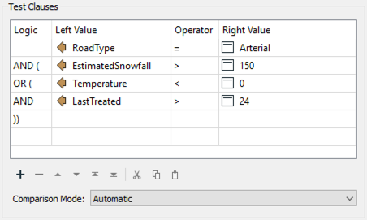
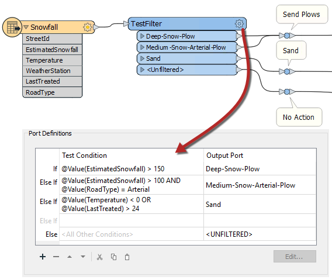

## The Tester and TestFilter Transformers ##

The Tester and TestFilter are the two key transformers for conditional filtering. They test the values on attribute values.

### Tester ###

The Tester transformer (number 1 in the top 30) is generally for single tests that produce a Yes/No result.

For example, here we wish to decide whether to send out snow plows (ploughs) to a particular road based on whether the value of the Snowfall attribute is greater than 150 mm (approximately 6 inches):

If snowfall is greater than 150, the road feature will pass the test and snow plows will be sent.

---

#### Multiple Clauses ####
Each clause in the Tester is an individual test that allows a Passed/Failed result. For example, each of the following criteria might be separate tests:

- Has there been more than 100 mm (4 inches) of snowfall?
- Is this a major road?
- Is the temperature less than zero degrees Celsius?
- Was sand last applied more than 24 hours ago?

However, the Tester allows the combination of multiple tests, where a user can combine any number of clauses using an AND and OR statement. So instead of individual tests, I might ask:

- Is this an Arterial (major) road AND has there been more than 100 mm of snow?

The Tester also allows the mixing of AND and OR statements using what is called a Composite Test. For example:

- Is this an Arterial road AND (has there been more than 100 mm of snow OR (is the temperature less than zero AND was the road treated (with sand) more than 24 hours ago))?

Notice that the numbers used in the composite test are the clause numbers listed on the left-hand side of the Test Clauses window.

But - however complex the test becomes - it still results in a single Yes/No (binary) result; features will either pass or fail this set of tests.

It's also worth remembering that we aren't restricted to simple tests of equality (A=B); in the above, there are also "greater than" and "less than" tests. That's because there are many different operators available for use in a test clause.

---

#### Operators ####
The list of operators available in the Tester transformer (or in many of the other locations that make use of the Tester dialog) looks like this:

Besides the usual operators, there are also some based on a SQL where clause. These include:

- In
- Like
- Contains
- Begins With
- Ends With
- Contains Regex

...plus there are other tests that check for the existence of attributes and values:

- Attribute has a value
- Attribute is Null
- Attribute is Empty String
- Attribute is Missing

---

<!--Tip Section-->

<table style="border-spacing: 0px">
<tr>
<td style="vertical-align:middle;background-color:darkorange;border: 2px solid darkorange">
<i class="fa fa-info-circle fa-lg fa-pull-left fa-fw" style="color:white;padding-right: 12px;vertical-align:text-top"></i>
TIP
</td>
</tr>

<tr>
<td style="border: 1px solid darkorange">

"Attribute has a value" is the opposite of the three other tests; i.e. this attribute is not Null, AND it is not an empty string, AND it is not missing. Incidentally, "missing" means the attribute does not exist at all on the feature being tested.

</td>
</tr>
</table>

---

<!--Tip Section-->

<table style="border-spacing: 0px">
<tr>
<td style="vertical-align:middle;background-color:darkorange;border: 2px solid darkorange">
<i class="fa fa-info-circle fa-lg fa-pull-left fa-fw" style="color:white;padding-right: 12px;vertical-align:text-top"></i>
TIP
</td>
</tr>

<tr>
<td style="border: 1px solid darkorange">

"Contains Regex" means only part of the string needs to match. For example...
<pre>
Attribute Value:  abcd
Search String:    ^ab
Contains Regex:  Passed
</pre>
i.e. the entire string doesn't need to match.

</td>
</tr>
</table>

---

### TestFilter ###
The TestFilter (#8 in the top 30) allows a number of conditions to be tested, each of which can have a number of test clauses. Each condition is given an output port, with an additional output port for features that fail all of the test conditions.

The TestFilter is very similar to the CASE or SWITCH command in programming or scripting languages. In Workbench it looks like this:

Notice that there are multiple conditions, and an output port for each. Each condition/port combination is equivalent to a single Tester transformer; hence the TestFilter is a good way to combine multiple Tester transformers into one.

The TestFilter output ports can be given custom names, rather than a simple PASSED/FAILED, which is another advantage to this transformer over the Tester.

The TestFilter has the full set of operators available with the Tester such as equals, greater than, less than, and so forth. Each condition is tested in turn.

Features that pass are output through the matching output port. Features that fail are sent on to the next condition in the list. Therefore it’s very important to get the conditions in the correct order.

---

<!--Person X Says Section-->

<table style="border-spacing: 0px">
<tr>
<td style="vertical-align:middle;background-color:darkorange;border: 2px solid darkorange">
<i class="fa fa-quote-left fa-lg fa-pull-left fa-fw" style="color:white;padding-right: 12px;vertical-align:text-top"></i>
Sister Intuitive says...
</td>
</tr>

<tr>
<td style="border: 1px solid darkorange">

The TestFilter is very good for filtering a feature by a set of cascading conditions, for example here are a set of tests to again determine whether to send out a snow plow:
  - Has there been more than 150 mm of snowfall?
 - Has there been more than 100 mm of snowfall AND is this an Arterial road?
 - Is the temperature less than zero degrees Celsius AND was sand last applied more than 24 hours ago?

  It’s a set of cascading tests because if there has been more than 150 mm of snow, the plows are sent out anyway; you don’t need to test any other criteria. So the test order can be very important. If every test is a fail, then the plows are not sent out.
  Also notice that you can include composite tests (those with ANDs or ORs in them).

</td>
</tr>
</table>

---

If using the above snowfall example, you were using three Tester transformers, you could save space on the workspace canvas and replace that setup with just a single TestFilter.

---

<!--Person X Says Section-->

<table style="border-spacing: 0px">
<tr>
<td style="vertical-align:middle;background-color:darkorange;border: 2px solid darkorange">
<i class="fa fa-quote-left fa-lg fa-pull-left fa-fw" style="color:white;padding-right: 12px;vertical-align:text-top"></i>
Chef Bimm says...
</td>
</tr>

<tr>
<td style="border: 1px solid darkorange">

Because the TestFilter can carry out a single test (as well as multiple ones) it's possible to use it exclusively instead of the Tester transformer.

</td>
</tr>
</table>
