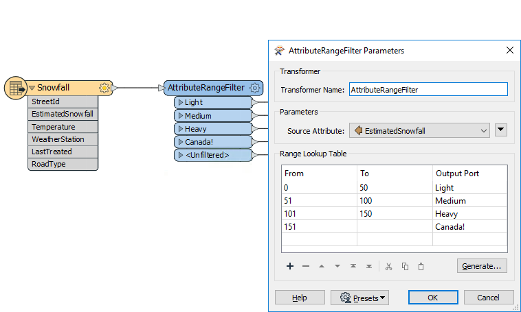

## Other Key Filter Transformers ##
The Tester and TestFilter are not the only useful filter transformers.

### AttributeFilter ###
The AttributeFilter transformer directs features by values in a chosen attribute. It is not a binary test (Yes/No) but a way to separate many values for a single attribute, for example:

- Is that road an Arterial, Collector, NonCity, Other, Private, Residential, or Secondary?

If you were using seven Tester transformers to separate this data, you could save space on the workspace canvas and replace that setup with just a single AttributeFilter.

---

<!--Tip Section-->

<table style="border-spacing: 0px">
<tr>
<td style="vertical-align:middle;background-color:darkorange;border: 2px solid darkorange">
<i class="fa fa-info-circle fa-lg fa-pull-left fa-fw" style="color:white;padding-right: 12px;vertical-align:text-top"></i>
TIP
</td>
</tr>

<tr>
<td style="border: 1px solid darkorange">

Use the Import... button to quickly add attributes from existing datasets.

</td>
</tr>
</table>

---

<!--Person X Says Section-->

<table style="border-spacing: 0px">
<tr>
<td style="vertical-align:middle;background-color:darkorange;border: 2px solid darkorange">
<i class="fa fa-quote-left fa-lg fa-pull-left fa-fw" style="color:white;padding-right: 12px;vertical-align:text-top"></i>
FME Lizard says...
</td>
</tr>

<tr>
<td style="border: 1px solid darkorange">

In almost every scenario where you are using multiple Tester transformers, it's possible to use a different filtering transformer to achieve the same result but using much less space on the canvas.

</td>
</tr>
</table>

---

The AttributeFilter also works with numeric values; however, its only "operator" is to find equivalency (=), so you would rarely use it for arithmetical tests. In that scenario, the better solution is the AttributeRangeFilter.

### AttributeRangeFilter ###
The AttributeRangeFilter carries out the same operation as the AttributeFilter, except that it can handle a range of numeric values instead of just a simple one-to-one match.

For example, we might want to separate data based on a range of snowfall values, like so:

Notice that the AttributeRangeFilter parameters dialog has a Generate button to generate ranges automatically from a set of user-defined extents.

---

### GeometryFilter ###
The GeometryFilter directs features on the basis of geometry type; for example, point, line, area, ellipse:

It can even filter data based on null geometry (tabular records):

The GeometryFilter is useful for:

- Filtering out unwanted geometry types; for example, removing non-linear features before using an AreaBuilder transformer
- Validating geometry against a list of permitted types; for example, where the dataset is constrained to either point or area features (above)
- Dividing up geometry types to write to separate destination Feature Types; for example, when writing to a geometry-restricted format such as Esri Shapefile

---

<!--Person X Says Section-->

<table style="border-spacing: 0px">
<tr>
<td style="vertical-align:middle;background-color:darkorange;border: 2px solid darkorange">
<i class="fa fa-quote-left fa-lg fa-pull-left fa-fw" style="color:white;padding-right: 12px;vertical-align:text-top"></i>
FME Lizard says...
</td>
</tr>

<tr>
<td style="border: 1px solid darkorange">

If the Tester, TestFilter, and AttributeFilter all filter features on the basis of an attribute condition, then what’s the difference? When would I use each?
  The best solution is to check out these two articles on the Safe Software blog:
 - <a href="https://blog.safe.com/2013/03/fmeevangelist113/">Conditional Processing in FME</a>
 - <a href="https://blog.safe.com/2015/05/fmeevangelist133/">A Simple Guide to FME Filter Transformers</a>
 There's also a useful table I put together:

</td>
</tr>
</table>

<table style="font-size:smaller;font-family:serif" border="1">
<tbody>
<tr style="height: 15.0pt;" valign="bottom">
<td style="height: 15.0pt; width: 103pt;" width="137" height="20"></td>
<td style="width: 130pt;" colspan="2" width="173" align="center">Single Test</td>
<td style="width: 130pt;" colspan="2" width="173" align="center">Multiple Tests</td>
<td style="width: 77pt;" colspan="2" width="103" align="center">Test Type</td>
<td style="width: 63pt;" width="84" align="center">Operators</td>
<td style="width: 63pt;" width="84" align="center">Attributes</td>
</tr>
<tr style="height: 15.0pt;" valign="bottom">
<td></td>
<td align="center">Single Clause</td>
<td align="center">Multi Clause</td>
<td align="center">Single Clause</td>
<td align="center">Multi Clause</td>
<td align="center">String</td>
<td align="center">Numeric</td>
<td></td>
<td></td>
</tr>
<tr style="height: 15.0pt;" valign="bottom">
<td>Tester</td>
<td align="center">Y</td>
<td align="center">Y</td>
<td align="center">–</td>
<td align="center">–</td>
<td align="center">Y</td>
<td align="center">Y</td>
<td align="center">16</td>
<td align="center">Multiple</td>
</tr>
<tr style="height: 15.0pt;" valign="bottom">
<td>TestFilter</td>
<td align="center">Y</td>
<td align="center">Y</td>
<td align="center">Y</td>
<td align="center">Y</td>
<td align="center">Y</td>
<td align="center">Y</td>
<td align="center">16</td>
<td align="center">Multiple</td>
</tr>
<tr style="height: 15.0pt;" valign="bottom">
<td>AttributeFilter</td>
<td align="center">Y</td>
<td align="center">Y</td>
<td align="center">–</td>
<td align="center">–</td>
<td align="center">Y</td>
<td align="center">–</td>
<td align="center">1</td>
<td align="center">1</td>
</tr>
<tr style="height: 15.0pt;" valign="bottom">
<td>AttributeRangeFilter</td>
<td align="center">Y</td>
<td align="center">Y</td>
<td align="center">–</td>
<td align="center">–</td>
<td align="center">–</td>
<td align="center">Y</td>
<td align="center">6</td>
<td align="center">1</td>
</tr>
</tbody>
</table>
