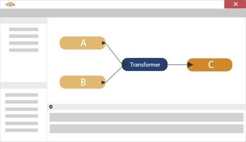

# Data Joins #
Transformers that join data together are also very commonly used in FME. It's so related to filtering that the transformer category is called Filters and Joins.

## What is a Data Join? ##
Whereas Filter transformers divide data into different streams, other transformers bring data streams together, merging the data according to a set of user-defined conditions. Here (for example) incoming streams A and B are joined together into a new stream, C:

It is necessary to do more than just draw two connections into the same input port to merge data in FME Workbench. Connecting data streams this way will only combine the data into a single stream, not fuse it together. You may know this as a union of data.

---

<!--New Section-->

<table style="border-spacing: 0px">
<tr>
<td style="vertical-align:middle;background-color:darkorange;border: 2px solid darkorange">
<i class="fa fa-bolt fa-lg fa-pull-left fa-fw" style="color:white;padding-right: 12px;vertical-align:text-top"></i>
NEW
</td>
</tr>

<tr>
<td style="border: 1px solid darkorange">

To emphasize this fact, the Junction transformer - which is designed to draw together multiple connections without merging data - has been given the alias of <strong>Union</strong> in FME2018.

</td>
</tr>
</table>

---

To merge data it is necessary to define a relationship for the basis of the join, and this is done with one of a number of transformers.

These transformers allow you to merge not just data that is being processed by the workspace but provide the ability to form a join against a database or other external dataset.

Joins in FME can either be based on matching attribute values (DatabaseJoiner or FeatureMerger/FeatureJoiner), or they can be based on a spatial relationship such as an overlap between features or proximity from one feature to another (NeighborFinder or SpatialRelator).
