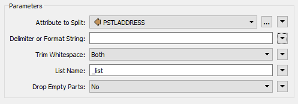
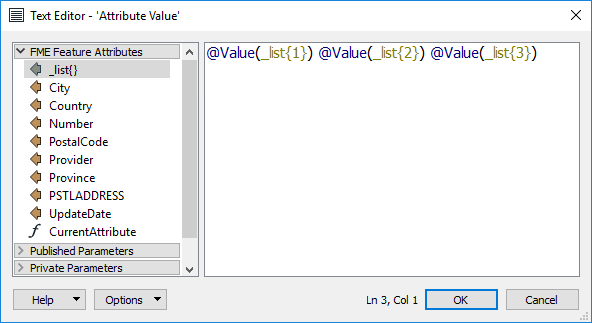

<!--Exercise Section-->

<table style="border-spacing: 0px;border-collapse: collapse;font-family:serif">
<tr>
<td width=25% style="vertical-align:middle;background-color:darkorange;border: 2px solid darkorange">
<i class="fa fa-cogs fa-lg fa-pull-left fa-fw" style="color:white;padding-right: 12px;vertical-align:text-top"></i>
Exercise 2
</td>
<td style="border: 2px solid darkorange;background-color:darkorange;color:white">
Noise Control Laws Project (Addresses)
</td>
</tr>

<tr>
<td style="border: 1px solid darkorange; font-weight: bold">Data</td>
<td style="border: 1px solid darkorange">Addresses (File Geodatabase)</td>
</tr>

<tr>
<td style="border: 1px solid darkorange; font-weight: bold">Overall Goal</td>
<td style="border: 1px solid darkorange">Convert a File Geodatabase to Microsoft Excel and map the schema</td>
</tr>

<tr>
<td style="border: 1px solid darkorange; font-weight: bold">Demonstrates</td>
<td style="border: 1px solid darkorange">Attribute Management for Schema Mapping</td>
</tr>

<tr>
<td style="border: 1px solid darkorange; font-weight: bold">Start Workspace</td>
<td style="border: 1px solid darkorange">None</td>
</tr>

<tr>
<td style="border: 1px solid darkorange; font-weight: bold">End Workspace</td>
<td style="border: 1px solid darkorange">C:\FMEData2018\Workspaces\DesktopBasic\Transformers-Ex2-Complete.fmw</td>
</tr>

</table>

City councillors have voted to amend noise control laws and local residents living in affected areas must be informed of these changes.

You have been recommended by your manager to take on the task of finding all affected addresses. There's a tight deadline and at least three city councillors are standing watching you work. The pressure is on, and it's up to you to deliver!

This exercise is the first part of the project. You know that the address database for the city is stored in an Esri Geodatabase whose schema matches the Local Government Information Model PostalAddress table. 

However, you are told that the software used to carry out automated bulk mailings requires addresses stored in an Excel spreadsheet using a completely different schema.

So, your first task is to create a workspace that converts addresses from Geodatabase to Excel, mapping the schema at the same time.

 **1) Inspect Data**
 As usual, the first task is to familiarize yourself with the data. To do this open the following dataset within the FME Data Inspector:

<table style="border: 0px">

<tr>
<td style="font-weight: bold">Reader Format</td>
<td style="">Esri Geodatabase (File Geodb API)</td>
</tr>

<tr>
<td style="font-weight: bold">Reader Dataset</td>
<td style="">C:\FMEData2018\Data\Addresses\Addresses.gdb</td>
</tr>

</table>

The table that is to be translated is called "PostalAddress." The important thing here is not how the data looks in the graphic display, but more what attributes exist in the Table View window.

**2) Add Creator/FeatureReader**
 Now that you are familiar with the source data, start FME Workbench and begin with an empty workspace. 

We can choose to read the source data using either a reader or a FeatureReader transformer. The FeatureReader will allow us to build in a spatial filter so - because we believe this project may need some filtering - we'll use a FeatureReader transformer with a Creator to create a feature to trigger it.

So place a Creator transformer and connect it to a FeatureReader:

Inspect the FeatureReader parameter. Set up the paarameters as follows:

<table style="border: 0px">

<tr>
<td style="font-weight: bold">Reader Format</td>
<td style="">Esri Geodatabase (File Geodb API)</td>
</tr>

<tr>
<td style="font-weight: bold">Reader Dataset</td>
<td style="">C:\FMEData2018\Data\Addresses\Addresses.gdb</td>
</tr>

<tr>
<td style="font-weight: bold">Feature Types to Read</td>
<td style="">PostalAddress</td>
</tr>

</table>

Ensure Run with Feature Caching is turned on and run the workspace. Inspect the FeatureReader:PostalAddress output cache to confirm that all addresses are being read correctly.

**3) Add Writer**
 Now let's add a writer to write the output data. There currently seems no benefit or need to use a FeatureWriter, so select Writers &gt; Add Writer from the menubar and use the following:

<table style="border: 0px">

<tr>
<td style="font-weight: bold">Writer Format</td>
<td style="">Microsoft Excel</td>
</tr>

<tr>
<td style="font-weight: bold">Writer Dataset</td>
<td style="">C:\FMEData2018\Output\Training\AddressFile.xlsx</td>
</tr>

<tr>
<td style="font-weight: bold">Sheet Definition</td>
<td style="">Import from Dataset</td>
</tr>

</table>

Setting 'Import from Dataset' will let us import an Excel spreadsheet to use as a guide. Click OK to add the writer.

 **4) Import Feature Types**
 At this point you are prompted to select the dataset to import a schema definition from. The two fields should be set up with the same values as the writer. Set the Dataset parameter as follows:

<table style="border: 0px">

<tr>
<td style="font-weight: bold">Reader Dataset</td>
<td style="">C:\FMEData2018\Resources\DesktopBasic\AddressSchema.xlsx</td>
</tr>

</table>

This file is our guide/template. Click OK to accept the values. The new feature type will be created to match the chosen Excel schema.

 **5) Add AttributeManager**
 Now we can start to map the schema from reader (FeatureReader) to writer. As you'll have noticed, the two do not currently match up very well.

So, place an AttributeManager connected between the two. 

Its parameters will look like this:

Firstly let's clear up the reader schema by removing some of the unwanted attributes. 

Click on the following attributes and press the - button to remove them:

- OBJECTID
- GlobalID
- OWNERNM1
- OWNERNM2
- INTSTATE
- INTPSTLCD
- REPRESENT
- STATUS
- LASTUPDATE
- LASTEDITOR

 **6) Rename Attributes**
 Several source attributes can be written to the output as they are, but do need renaming first.

In the AttributeManager rename the following:

- PSTLCITY to City
- PSTLPROV to Province
- POSTALCODE to PostalCode
- COUNTRY to Country

If the AttributeManager is connected to the writer feature type then you should be able to select the Output Attribute field from a drop-down list instead of typing it in.

 **7) Create Attribute (Provider)**
 Two attributes on the output (Provider and UpdateDate) are new and cannot be copied from the source data. They must be created. 

In the AttributeManager create the new attribute "Provider". Because the attribute exists on the output schema, you can again select it from the drop-down list.

Set a fixed value such as your own organization name, "Safe Software", or "City of Interopolis."

 **8) Create Attribute (UpdateDate)**
 Now create the new attribute "UpdateDate". Rather than hard-coding a value click on the drop-down arrow in the Attribute Value field and choose Open Text Editor.

In the text editor locate the Date/Time Function called DateTimeNow and double-click to place it in the editor. By default it creates a datetime in ISO syntax, which is fine for us, so simply click OK to accept this.

Click OK again to close the AttributeManager dialog.

 **9) Run Transformer**
 Run the workspace by clicking on the AttributeManager transformer and selecting Run to This: 

**NB: FOR NOW USE RUN FROM THIS (RUN TO THIS CAUSES A CRASH, PR#82356**

This will run the transformer by itself, using previous caches, but not writing any output (which we don't need yet).

Inspect the AttributeManager:Output cache to confirm that the procedure worked as expected:

 **9) Add AttributeSplitter**
 Looking at the output schema there are two fields for Number and Street (for example "3305" and "W 10th Av"). However, the source schema condenses that information into one field with &lt;space&gt; characters separating the fields ("3305 W 10th Av"). Therefore we'll have to split the source attribute up in order to match the Writer schema.

Insert an AttributeSplitter transformer. Insert it ***before*** the AttributeManager - then if there are any actions to carry out on the split attributes we can use the same AttributeManager transformer.

View the AttributeSplitter parameters. Set PSTLADDRESS as the attribute to split and enter a space character into the Delimiter parameter. Ensure that a list name is set in that particular parameter.

Click OK to close the dialog. If you run the workspace now and inspect the cache, you'll see the address as a list attribute in the Feature Information window:

<pre>
_list{0} (encoded: utf-8) 3305
_list{1} (encoded: utf-8) W
_list{2} (encoded: utf-8) 10th
_list{3} (encoded: utf-8) Av
</pre>

Remember a list attribute is one that can store multiple values under a single name (_list).

 **10) Rename Attribute**
 Now let's handle the Number field in the output. Go back to the AttributeManager parameters. 

Notice that there is now an entry for the list attribute called _list{}. However, this is just the list attribute *"in general"* - it isn't showing each element (value) in the list.

What we need to do is create a new attribute and copy the list element we want into it. So, in the Output Attribute field create a new attribute called Number by selecting it from the drop-down list.

For the Attribute Value field click the drop-down arrow and select Attribute Value &gt; _list{}...

You will now be prompted to select the element in the list. Ensure it is set to zero (0) and click OK.

Click Apply/OK to confirm the changes. Run the workspace and inspect the AttributeManager:Output cache to ensure the number is being copied.

 **11) Construct Attribute**
 The final step is to recreate the Street attribute, without it being prefixed by the address number.

View the AttributeManager parameters again. This time in the Output Attribute field create a new attribute called Street by selecting it from the list.

Unlike the Number field, we want to create this value by concatenating several list elements. So click the drop down arrow in the Attribute Value field and choose Open Text Editor.

Locate _list{} in the FME Feature Attributes menu and carry out the following steps:

<ul>
<li>Double-click _list{} and when prompted select element 1</li>
<li>Press the spacebar to enter a &lt;space&gt; character</li>
<li>Double-click _list{} and when prompted select element 2</li>
<li>Press the spacebar to enter a &lt;space&gt; character</li>
<li>Double-click _list{} and when prompted select element 3</li>
</ul>

The dialog will now look like this:

In this way we will have concatenated all parts of the street name back together, for example:

<pre>
"W"+"17th"+"St" becomes "W 17th St"
</pre>

We're assuming that no street name has more than three parts to it, but that's reasonable for our example.

**12) Run Workspace**
 Save the workspace. Turn off feature caching and then run the workspace.

---

<!--Warning Section--> 

<table style="border-spacing: 0px">
<tr>
<td style="vertical-align:middle;background-color:darkorange;border: 2px solid darkorange">
<i class="fa fa-exclamation-triangle fa-lg fa-pull-left fa-fw" style="color:white;padding-right: 12px;vertical-align:text-top"></i>
WARNING
</td>
</tr>

<tr>
<td style="border: 1px solid darkorange">

The Excel writer has a parameter called <strong>Overwrite Existing File</strong>, which by default is set to <strong>No</strong>.
  
  This is probably a good time to change the parameter to Yes, because we've been running the workspace multiple times!

</td>
</tr>
</table>

---

Open the containing folder to check the output has been written. Inspect the data in the FME Data Inspector. The output (in the Table View window) should look like this:

---

<!--Tip Section--> 

<table style="border-spacing: 0px">
<tr>
<td style="vertical-align:middle;background-color:darkorange;border: 2px solid darkorange">
<i class="fa fa-info-circle fa-lg fa-pull-left fa-fw" style="color:white;padding-right: 12px;vertical-align:text-top"></i>
TIP
</td>
</tr>

<tr>
<td style="border: 1px solid darkorange">

The Event field is still empty at this point, but will be completed in a subsequent exercise.

</td>
</tr>
</table>

---

<!--Exercise Congratulations Section--> 

<table style="border-spacing: 0px">
<tr>
<td style="vertical-align:middle;background-color:darkorange;border: 2px solid darkorange">
<i class="fa fa-thumbs-o-up fa-lg fa-pull-left fa-fw" style="color:white;padding-right: 12px;vertical-align:text-top"></i>
CONGRATULATIONS
</td>
</tr>

<tr>
<td style="border: 1px solid darkorange">

By completing this exercise you have learned how to:
 
<ul><li>Use the AttributeManager transformer to create, delete, and rename attributes</li>
<li>Use the AttributeSplitter to split attributes into a list attribute</li>
<li>Handle list attributes in the AttributeManager</li>
<li>Use a Date/Time function in the AttributeManager text editor</li></ul>

</td>
</tr>
</table>
