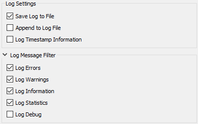

## Logging and Log Interpretation ##
FME logs contain a record of all stages and processes within a translation. The contents are therefore vital for debugging purposes.

### Log Message Types ###

There are different message types that show in the log window including:

**Error**: An error, denoted in the log by red text and the term **ERROR**, indicates that a problem has caused FME to cease processing. For example, FME is unable to write the output dataset because of incorrect user permissions.

**Warning**: A warning, denoted by blue text and the term **WARN**, indicates a processing problem. The problem is sufficiently minor to allow FME to complete the translation, but the output may be adversely affected and should be checked. For example, FME is unable to write features because its geometry is incompatible with the writer format. The features will be dropped from the translation and a warning issued in the log.

**Information**: Information messages, denoted by the term **INFORM**, indicate a piece of information that may help a user determine whether their translation has been processed correctly. For example, FME sometimes logs confirmation of a particular dataset parameter, such as the coordinate system.

**Statistics**: Statistics messages, denoted by the term **STATS**, provide information on various numbers relating to the translation; for example, the number of features read from a source dataset, and the time it took to do so.

---

### Log File Options ###

Log file options are important to set up (*before* running the workspace) so that we receive information in the structure that we require. These options are accessed via the cogwheel icon on the log window:

The log options allow us to control how data is presented and in what format:

The Log Timestamp Information option is critical when you are debugging a workspace's performance, as it adds information about the length of time taken for each step. It also causes the type of message to be shown (ERROR, WARN, etc.).

The ability to filter messages is not particularly important, as message types can be filtered directly in the log window.

The Log Debug option causes FME to show messages from a deeper level in the FME engine. This option should **NOT** be turned on for general use, but only once a workspace has already been shown to fail, and extra information is required. Otherwise, it's possible to be confused by unusual messages that are part of the normal process.

---

<!--Person X Says Section-->

<table style="border-spacing: 0px">
<tr>
<td style="vertical-align:middle;background-color:darkorange;border: 2px solid darkorange">
<i class="fa fa-quote-left fa-lg fa-pull-left fa-fw" style="color:white;padding-right: 12px;vertical-align:text-top"></i>
FME Lizard says...
</td>
</tr>

<tr>
<td style="border: 1px solid darkorange">

Log Debug is particularly useful when tracking down HTTP-related issues.

</td>
</tr>
</table>

---

### Spatial Log File ###

Besides writing the log to a text file (&lt;workspace name&gt;.log) FME also writes a spatial log:

The spatial log is a dataset of features (in FME Feature Store format) that have been mentioned in the log - either because of a warning from FME, use of the Logger transformer or &lt;Rejected&gt; features.

The dataset can be opened within FME Data Inspector or the Visual Preview window in FME Workbench to inspect the features and identify any problems that caused them to be rejected.

---

### Interpreting the Log Window ###

The log window should be the **first** place to check when a translation is completed. It will tell the user whether there are any concerning errors or warnings.

#### Errors ####
If an ERROR occurs, it is likely that the translation will be halted. There will be a lot of red text and some  statements such as:

> Program Terminating
>
> Translation FAILED.

There may be several ERROR messages, so scroll back up the log window to try and identify the first of these, which is likely to be the cause of the problem. For example this message:

> ERROR |Error connecting to PostgreSQL database(host='postgis.train.safe.com', port='5432', dbname='fmedata', user='fmedata', password='***'): 'FATAL:  password authentication failed for user "fmedata"
FATAL:  password authentication failed for user "fmedata"

...is an obvious problem with authenticating a database connection.

#### Warnings ####
Even when a translation succeeds, it's important to check the log for the following comment:

> Translation was SUCCESSFUL with X warning(s)

If there are any warnings (i.e., if X &gt; 0) then use the search option to look for the word WARN. Any warning messages might have important consequences for the quality of the output data.
