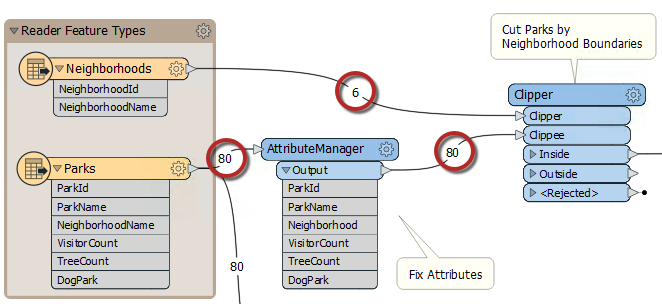
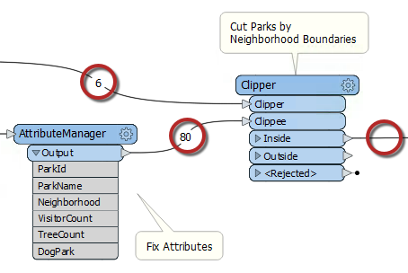
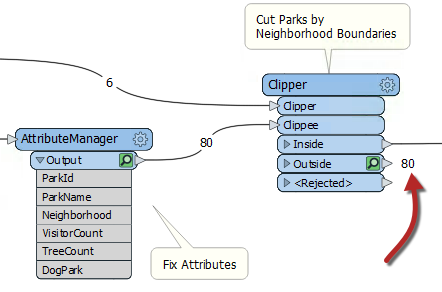
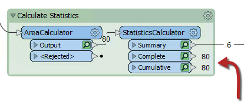
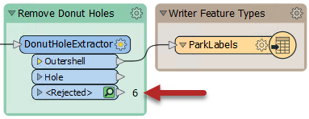
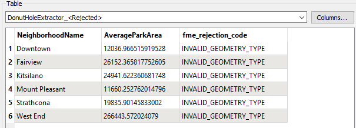

## Feature Counts ##
A workspace **Feature Count** refers to the numbers shown on each connection once a translation is complete:

Once an error or problem has been determined to exist, feature counts help us identify *where* that problem occurred.

In the above screenshot, if the Clipper output were incorrect, then you would inspect the prior feature counts to see if any counts looked wrong (perhaps you know that there are seven neighborhoods, but the feature count shows only six).

---

### Incorrect Output ###

When the number of output features is incorrect, then there are several things to check.

If you get zero output, and the feature counts show that all features entered a transformer, but none emerged, then you can be fairly confident that the transformer is the cause of the problem:

Here, for example, 80 features enter the Clipper transformer (to be clipped against a single boundary) but none emerged. The Clipper transformer is almost certainly the cause of any incorrect output.

The data is not rejected as invalid; it merely does not pass the test expected. It's possible that Clipper and Clippee don't occupy the same coordinate system; hence, one does not fall inside the other.

Turning on feature caching helps to confirm this to be the case:

Alternatively - and this is a common cause of missing features - the author has connected the wrong output port! For example, this user has connected the StatisticsCalculator Summary output port, when they really wanted the Complete port connected:

Again Feature Caching gives us a clue to what port we should connect.

---

### Rejected Features ###

Sometimes when features go missing, they are being rejected by a transformer. Many transformers include a &lt;Rejected&gt; port to output these invalid features:

Remember, features are automatically counted and stored on a &lt;Rejected&gt; port, even if Feature Caching is turned off.

As an additional benefit, the rejected features will often include a rejection code attribute:

