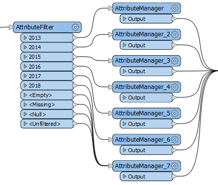
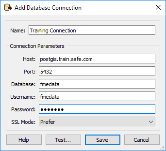
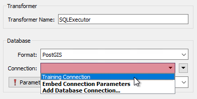

## Maintenance Methodology ##

Maintenance methodology is weak when a workspace's design doesn't allow easy updates or expansion. There are some key indicators that indicate design weakness.

---

### Duplicated Transformers ###
Duplicating the same transformer again and again – maybe creating multiple streams to do so – indicates a weak design. 

For example, the multiple AttributeManager transformers here will cause maintenance problems:

The first problem is that each additional year to be supported requires a new transformer to handle it. The second problem is that should a small change be required in the AttributeManager, then each transformer will need to be individually edited.

We can also say that this layout results in a style that is not as compact as it should be.

The solution here is to replace all of the above with a single AttributeValueMapper transformer (or possibly a SchemaMapper) to allow scaling with the minimum number of edits. 

The general solution is to watch for instances of multiple transformers, and try to assess whether there is a better design.

---

### Complexity ###
A workspace design is weak when it is more complex than necessary. Complexity means a solution becomes harder to maintain and harder to scale, especially when carried out by someone other than the original author.

There are various types of complexity to watch for:

- **Excess Scripting**: The use of Python scripting when an equivalent transformer already exists
- **Low Level Complexity**: The use of FME functions and factories when an equivalent transformer already exists
- **Multiple Workspaces**: When multiple workspaces are chained in a way that is unnecessary
- **Workspace Style**: When workspace style is so convoluted it is difficult to understand

Before putting a project into production it is worth asking a colleague to evaluate it for clarity. Sections of workspace they cannot easily understand are points that future authors will also find difficult to maintain. 

<!--Tip Section--> 

<table style="border-spacing: 0px">
<tr>
<td style="vertical-align:middle;background-color:darkorange;border: 2px solid darkorange">
<i class="fa fa-info-circle fa-lg fa-pull-left fa-fw" style="color:white;padding-right: 12px;vertical-align:text-top"></i>
TIP
</td>
</tr>

<tr>
<td style="border: 1px solid darkorange">

For a new FME user with strong scripting skills, Python transformers provide particularly tempting shortcuts. However, other workspace authors may not be as skilled in Python, and find it difficult to debug without a full Python development environment.

</td>
</tr>
</table>

---

### Database Connections ###

Database formats require connection parameters. Sometimes these parameters need to be applied multiple times in the same workspace, and sometimes the parameters need to be changed when switching platforms (for example from testing to a live environment).

It is possible to embed database connection values inside a workspace, adding that information wherever it is required. However, a better solution involves a tool in FME called Database Connections.

Database Connections are a pre-defined set of connection and authentication parameters, stored under a single name. Once created, a connection name is used in lieu of the actual parameters.

#### Creating a Database Connection ####

When using a database format and prompted for connection details, choose the option to add a connection:

A new connection is defined by selecting the database type, entering connection parameters, and giving the connection a name:

Now, whenever a database connection is required (here in a SQLExecutor transformer) the pre-defined connection is selected:

Now repeated use of a database does not require repeated entry of the same credentials, and if the credentials change only one connection needs to be edited. Both of these benefit maintenance and scaling of a workspace.

Another benefit is that of security. Embedded connection information is stored inside the workspace file, posing a potential security risk. Database Connections are stored securely, outside of the workspace, and can not easily be accessed by someone else. If the workspace is passed to another user, they will have to set up their own connection with their own parameters.

---

<!--Person X Says Section-->

<table style="border-spacing: 0px">
<tr>
<td style="vertical-align:middle;background-color:darkorange;border: 2px solid darkorange">
<i class="fa fa-quote-left fa-lg fa-pull-left fa-fw" style="color:white;padding-right: 12px;vertical-align:text-top"></i>
Firefighter Mapp says...
</td>
</tr>

<tr>
<td style="border: 1px solid darkorange">

It's better to be safe than sorry. You don't want to get burned by bad designs. If you're unsure about a workspace, consult <a href="https://knowledge.safe.com/questions/index.html">other FME users</a>, or contact the <a href="http://www.safe.com/support">Safe Software support team</a> for advice.
  Also, be sure to check out this blog post on <a href="https://blog.safe.com/2015/06/fmeevangelist136/">FME and Code Smells.</a>
</td>
</tr>
</table>

