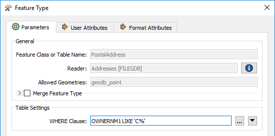
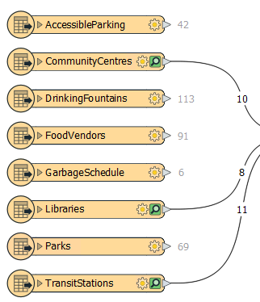
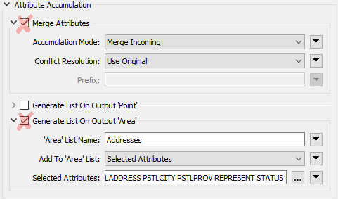

## Performance Methodology ##

Performance methodology is weak when a workspace's design causes the workspace to use more system resources (CPU and memory) than necessary. Like maintenence methodology, there are some key indicators that indicate design weakness.

Performance methodology means setting up a workspace to run proficiently.

---

### Filtering Input ###

A common scenario in FME is to read data into a workspace and then filter out features (records) that are not required:

 

However, when data is read and immediately discarded, the resources used to read that data are a direct loss to performance. 

If data is filtered as it is read - rather than afterwards - performance is much better, and many formats have parameters to do just that: 

Here a ‘WHERE Clause’ parameter applies the required filter directly to the Geodatabase reader. Only data that matches the where clause is read and enters the workspace. 

---

### Excess Feature Types ###

The schema of a source dataset is represented on the FME canvas by feature type objects:

Not connecting a feature type is equivalent to reading and discarding data, and is likewise detrimental to performance. 

When adding readers FME prompts the user to select feature types to add to the translation. You should avoid adding feature types you don't need, and remove ones that are already added but not connected. 

---

<!--Person X Says Section-->

<table style="border-spacing: 0px">
<tr>
<td style="vertical-align:middle;background-color:darkorange;border: 2px solid darkorange">
<i class="fa fa-quote-left fa-lg fa-pull-left fa-fw" style="color:white;padding-right: 12px;vertical-align:text-top"></i>
Dr. Workbench says...
</td>
</tr>

<tr>
<td style="border: 1px solid darkorange">

Not only do excess feature types slow down your work, they clutter the canvas and make it harder to keep a clean and tidy style.

</td>
</tr>
</table>

---

### Excess Attributes and Lists ###

Once data has been read into a workspace, it still can be reduced in size to assist performance. For example, attributes not defined in the output schema are not necessary to a workspace and can be removed:

Here a workspace author is calculating the number of addresses in each postcode (CFSAUID) of a city. The address attributes are not required in the output schema, but are copied on to the postcode features, along with a list of addresses, and everything carried through to the end of the workspace.

In this scenario the author should avoid the PointOnAreaOverlayer options for copying attributes and creating lists:

This will reduce the amount of memory required to run the translation, with no effect on its output.

---

<!--Person X Says Section-->

<table style="border-spacing: 0px">
<tr>
<td style="vertical-align:middle;background-color:darkorange;border: 2px solid darkorange">
<i class="fa fa-quote-left fa-lg fa-pull-left fa-fw" style="color:white;padding-right: 12px;vertical-align:text-top"></i>
Dr. Workbench says...
</td>
</tr>

<tr>
<td style="border: 1px solid darkorange">

Lists are the worst attribute type to keep for no reason, since they can have multiple values for each record. Parameters in many join transformers allow the author to generate only the list attributes required:
  

</td>
</tr>
</table>

---

### Error Trapping ###

Sometimes scaling up/performance means using more datasets of varying types and quality. If data quality is not considered then future performance can be compromised.

One way to design for future capabilities is using error trapping.

Error trapping is a way to design a workspace such that unexpected data does not cause the workspace to fail. The author attempts to foresee data problems that might arise and build in methods to handle them.

Error trapping can be as simple as adding a test or filter transformer to weed out bad features, or it can be more complex and include ways to process data in different ways depending on different circumstances.

---

<!--Tip Section--> 

<table style="border-spacing: 0px">
<tr>
<td style="vertical-align:middle;background-color:darkorange;border: 2px solid darkorange">
<i class="fa fa-info-circle fa-lg fa-pull-left fa-fw" style="color:white;padding-right: 12px;vertical-align:text-top"></i>
TIP
</td>
</tr>

<tr>
<td style="border: 1px solid darkorange">

The Tester transformer has an operator for testing whether an attribute has a value:
  
  This is very useful for error trapping, to test whether an attribute has a value before trying to use it as the source for a parameter.

</td>
</tr>
</table>
