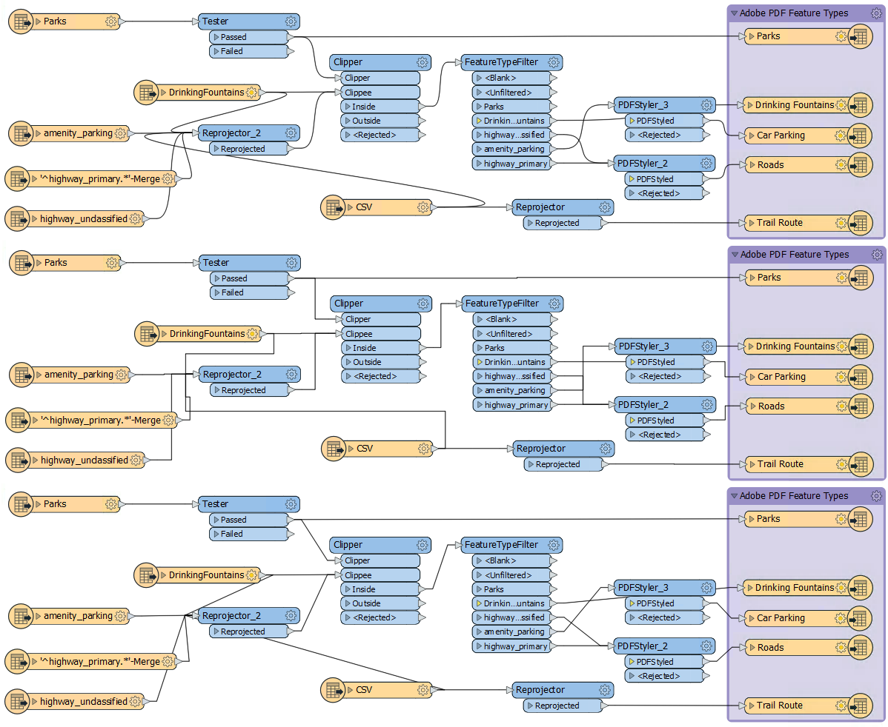
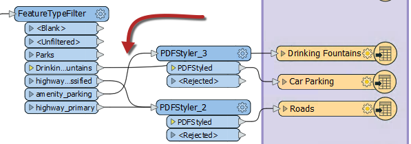
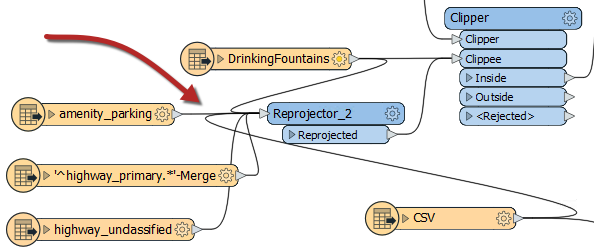
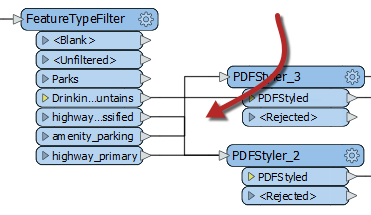
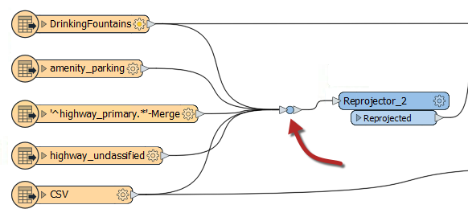
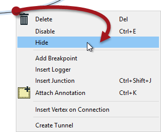
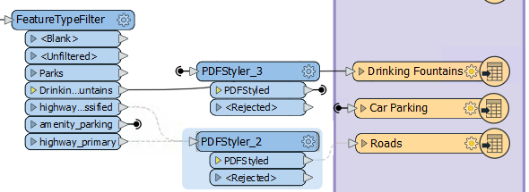

## Connection Style ##

It's also worth noting that object positioning is only part of a good layout. The other key part is the connection style.

As with the positioning of workspace objects, the care taken in connecting them can make the difference between a poorly-designed workspace and one that is visually attractive and efficient.

### Connection Styles ###

Connections are the lines between objects on the workspace canvas. There are three different styles of connection that you can create in Workbench:

- Curved: The default style with curved line connections
- Squared: A style that evokes a Manhattan skyline through squared connections
- Straight: The original connection style; a straight line between two objects

You can switch between styles using either the View menu, the FME Options menu, or the shortcut <kbd>Ctrl</kbd>+<kbd>Shift</kbd>+<kbd>C</kbd>. This image shows a comparison of the three styles:

Once more, there is no right or wrong choice about which style to use; it is more a personal preference. However, object layout and connection style are related; the best FME authors will vary the position of objects according to the connection style used to avoid issues like overlapping connections.

---

### Overlapping Connections ###

One of the most obvious failings of a workspace design is to have connections that cross over each other, for example like this:

The visibility and intent of a connection are always compromised when it overlaps with either another connection or another object on the canvas. However, the choice of connection style affects the possibility of overlap occurring. For example, curved connections tend to cross over more than straight ones:

...and squared connections can sometimes cross in ways that are difficult to decipher:

Because these issues can spring up when you switch connection style, it's wise to choose a particular connection style and layout technique and stick with it. For example, in a curved connection workspace transformers could perhaps be spaced more widely to avoid overlaps.

---

### Junctions ###

There is one transformer in FME Workbench that is designed to be used to enhance the layout of objects and connections. That transformer is called the **Junction**.

This transformer is a small, node-like object, that carries out no function on the data, but is instead used to tidy connections within a workspace - as in the above screenshot. This trait makes it an excellent tool for best practice.

As with any other transformer, a junction can be connected to an Inspector or Logger, and it can have annotation objects attached to it. It also works with both Quick Add, Drag/Connect functionality, and Feature Caching.

---

### Hidden Connections and Tunnels ###

The ability to hide connections is especially useful for avoiding overlaps. To hide a connection, right-click on it and choose the option to Hide:

A hidden connection is represented by a 'transmitter' icon, or by a greyed-out dashed line when the object at one end of the connection is selected:

Here the object (transformer or feature type) must be selected for the connection to be visible.

The other available option is "Create Tunnel." This choice creates a hidden connection with the addition of an annotated junction transformer at each end:

A tunnel makes a hidden connection slightly more apparent, plus allows for annotation at each end.

#### Revisualizing Hidden Connections ####

To view hidden connections, click on an object at either end. The connection is highlighted as a greyed-out dashed line.

To return a connection to view, right-click an object to which it is connected and choose Show Connection(s).

For more information on Tunnels and Junctions see <strong><a href="https://www.safe.com/blog/2016/05/fmeevangelist150//">this blog post</a></strong>.
