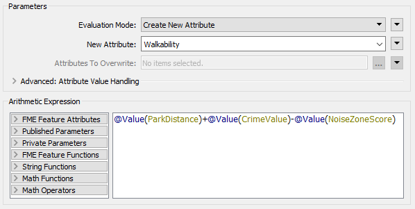
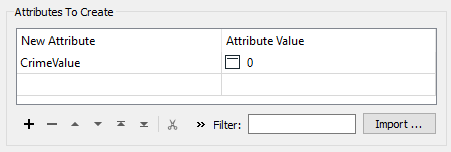

<!--Exercise Section-->

<table style="border-spacing: 0px;border-collapse: collapse;font-family:serif">
<tr>
<td width=25% style="vertical-align:middle;background-color:darkorange;border: 2px solid darkorange">
<i class="fa fa-cogs fa-lg fa-pull-left fa-fw" style="color:white;padding-right: 12px;vertical-align:text-top"></i>
Exercise 3
</td>
<td style="border: 2px solid darkorange;background-color:darkorange;color:white">
Debugging a Workspace
</td>
</tr>

<tr>
<td style="border: 1px solid darkorange; font-weight: bold">Data</td>
<td style="border: 1px solid darkorange">Addresses (Esri Geodatabase) Crime Data (CSV - Comma Separated Value) Parks (MapInfo TAB) Swimming Pools (OSM - OpenStreetMap)</td>
</tr>

<tr>
<td style="border: 1px solid darkorange; font-weight: bold">Overall Goal</td>
<td style="border: 1px solid darkorange">Work on Vancouver Walkability Project</td>
</tr>

<tr>
<td style="border: 1px solid darkorange; font-weight: bold">Demonstrates</td>
<td style="border: 1px solid darkorange">Debugging Best Practice</td>
</tr>

<tr>
<td style="border: 1px solid darkorange; font-weight: bold">Start Workspace</td>
<td style="border: 1px solid darkorange">C:\FMEData2019\Workspaces\DesktopBasic\BestPractice-Ex3-Begin.fmwt</td>
</tr>

<tr>
<td style="border: 1px solid darkorange; font-weight: bold">End Workspace</td>
<td style="border: 1px solid darkorange">C:\FMEData2019\Workspaces\DesktopBasic\BestPractice-Ex3-Complete.fmwt</td>
</tr>

</table>

Continuing from the previous exercise, you have been assigned to a project to calculate the "walkability" of each address in the city of Vancouver. Walkability is a measure of how easy it is to access local facilities on foot. The workspace currently assesses crime, parks, and noise-control areas, but it doesn't give an overall measure of walkability.

So let's do that, and then see if there are any other aspects we can include.

---

 **1) Add ExpressionEvaluator**
 We can create a measure of walkability that combines all of our current values using the ExpressionEvaluator transformer.

So add an ExpressionEvaluator transformer to the end of the workspace.

Inspect its parameters. Set it up to create a new attribute called Walkability that is:

<pre>
ParkDistance + CrimeValue - NoiseZoneScore
</pre>

With this expression, the smaller the result, the better. Run the workspace using Run from This on the ExpressionEvaluator.

 **2) Assess Result**
 Let's assess whether the result of the translation is correct.

Firstly check the log window for errors and warnings. There are no errors, but there are over 13,000 warnings, which is not a good sign:

The warnings say:

<pre>
ExpressionEvaluator: Failed to evaluate expression '@real64(560.3272250455418+&lt;null&gt;-0)'.
Result is set to null
</pre>

Inspect the output cache, and some addresses do indeed have a Walkability value of &lt;null&gt;.

So we know there is a problem, let's try and figure out where the problem is and why it occurs.

 **3) Locate Problem**
 We can tell the warning comes from the ExpressionEvaluator, but that doesn't necessarily mean that is where the problem lies. The calculation fails because the middle value is &lt;null&gt;. If the expression is:

<pre>
ParkDistance + CrimeValue - NoiseZoneScore
</pre>

Then we know that it must be the CrimeValue that is an issue. Expand the bookmark that carries out the crime calculation. Then carry out a Run From This on the FeatureJoiner transformer, so that we have caches for transformers in the bookmark, and feature counts for all connections:

We know that some features from here are getting a &lt;null&gt; result. Firstly check the cache for the AttributeValueMapper. That's where values are set, so perhaps nulls are coming out of there?

---

<!--Tip Section-->

<table style="border-spacing: 0px">
<tr>
<td style="vertical-align:middle;background-color:darkorange;border: 2px solid darkorange">
<i class="fa fa-info-circle fa-lg fa-pull-left fa-fw" style="color:white;padding-right: 12px;vertical-align:text-top"></i>
TIP
</td>
</tr>

<tr>
<td style="border: 1px solid darkorange">

A useful test would be to right-click on CrimeValue in the Table View window, and sort by ascending numeric order. That will put any null values to the top of the table.

</td>
</tr>
</table>

---

On inspection, I find there are no &lt;null&gt; values for the CrimeValue attribute in there. Neither are there nulls for the Aggregator and CenterPointReplacer caches.

So check the feature counts on each connection. There are 4,270 features tagged with a crime, and 9,327 that are not. That gives a total of 13,597, which is correct.

Oh. Do you see it yet? The 9,327 features that are not tagged with a crime: what CrimeValue do they get? Inspect the UnjoinedLeft output from the FeatureJoiner, and you will see that they do not have a value. That's why the ExpressionEvaluator says that there are nulls.

---

<!--Tip Section-->

<table style="border-spacing: 0px">
<tr>
<td style="vertical-align:middle;background-color:darkorange;border: 2px solid darkorange">
<i class="fa fa-info-circle fa-lg fa-pull-left fa-fw" style="color:white;padding-right: 12px;vertical-align:text-top"></i>
TIP
</td>
</tr>

<tr>
<td style="border: 1px solid darkorange">

To confirm this I copied the log into a text editor and searched for the phrase "ExpressionEvaluator: Failed to evaluate expression".
 It appeared 9,327 times, the same as the number of features that exit the UnjoinedLeft port. Coincidence?

</td>
</tr>
</table>

---

 **4) Fix Problem**
 If those features do not have a CrimeValue attribute, then we should give them one. To do so add an AttributeCreator transformer to the workspace and expand the Manage Crime Data Joins bookmark to enclose it:

Open up its parameters and create an attribute called CrimeValue with a value of zero (0).

Collapse the bookmark and re-run the workspace (using Run to This on the ExpressionEvaluator). You should now find that there are way fewer warnings and that the output contains no &lt;null&gt; values.

 **5) Round Attribute**
 One issue in the data is that the results are measured to multiple decimal places. This step is not necessary. A quick look at the data shows us the ParkDistance result is the one to blame.

So, locate where the ParkDistance value is created and add an AttributeRounder transformer to round it to zero decimal places:

 **6) Add Swimming Pools**
 Since we now have the ability to calculate walkability values, let incorporate swimming pools into the calculation. To do this add a reader with the following:

<table style="border: 0px">

<tr>
<td style="font-weight: bold">Reader Format</td>
<td style="">OpenStreetMap (OSM) XML</td>
</tr>

<tr>
<td style="font-weight: bold">Reader Dataset</td>
<td style="">C:\FMEData2019\Data\OpenStreetMap\leisure.osm</td>
</tr>

</table>

When prompted, select only the leisure feature type:

 **7) Filter Leisure Data**
 If you inspect the leisure data, you'll notice that there are various types of leisure facility, the type being recorded in the *leisure* attribute.

So, set up a Tester transformer to test for leisure = swimming_pool

 **8) Find Nearest Pool**
 The technique to find the nearest swimming pool is identical to that to find the nearest park. So expand the Nearest Park bookmark, and copy/paste the transformers from inside it.

Place a bookmark around it and connect it up in the same way as the parks section:

Inspect the parameters of the newly pasted transformers. The NeighborFinder transformer has nothing that needs to be set, but the AttributeRenamer and AttributeRounder need to use PoolDistance instead of ParkDistance.

 **9) Update ExpressionEvaluator**
 Now simply update the ExpressionEvaluator to take account of the new PoolDistance attribute:

Re-run the workspace. Check the log for warnings and errors, and then inspect the ExpressionEvaluator cache.

Notice that the walkability scores are exceedingly large all of a sudden, due to the PoolDistance. Something is wrong, but what?

 **10) Locate Problem**
 The PoolDistance is the source of the problem. There is no related log message to give a clue, and the Feature Count numbers look correct.

So, right-click the Find Nearest Pool bookmark and choose Select all Objects in Bookmark. Now press <kbd>Ctrl</kbd>+<kbd>I</kbd> to inspect the selected objects' caches.

The display window in the Data Inspector shows two specks of data, a long distance apart. This result is typical of a mismatch of coordinate systems.

Query some features, and you will see that the main data has a coordinate system of UTM83-10, while the leisure data from OSM has a coordinate system of LL84.

This disparity is why the "nearest" pool to each address is such a high distance.

 **11) Fix Coordinate System Problem**
 The obvious solution is to reproject the pools to the correct coordinate system. So, add a Reprojector transformer to reproject the leisure data before it gets to the NeighborFinder:

Inspect its parameters and set it up to reproject from LL84 to UTM83-10

Collapse all bookmarks and re-run the appropriate parts of the workspace. Check the log window and inspect the ExpressionEvaluator cache.

Each address now has a walkability score, with a lower number being better and a higher number worse.

---

<!--Exercise Congratulations Section-->

<table style="border-spacing: 0px">
<tr>
<td style="vertical-align:middle;background-color:darkorange;border: 2px solid darkorange">
<i class="fa fa-thumbs-o-up fa-lg fa-pull-left fa-fw" style="color:white;padding-right: 12px;vertical-align:text-top"></i>
CONGRATULATIONS
</td>
</tr>

<tr>
<td style="border: 1px solid darkorange">

By completing this exercise you have learned how to:
 
<ul><li>use the ExpressionEvaluator transformer</li>
<li>Check the log window for errors and warnings</li>
<li>Locate problems through use of Feature Counts and Data Inspection</li>
<li>Identify and fix problems in a workspace</li></ul>

</td>
</tr>
</table>
