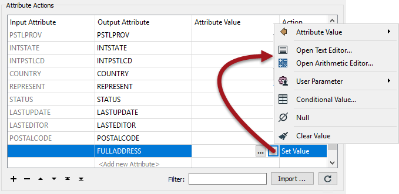
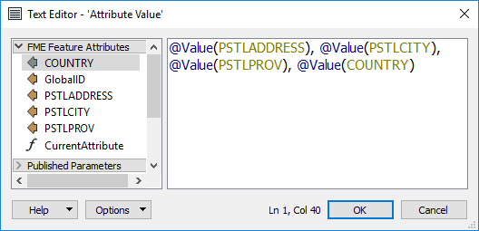
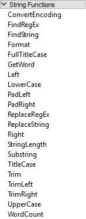
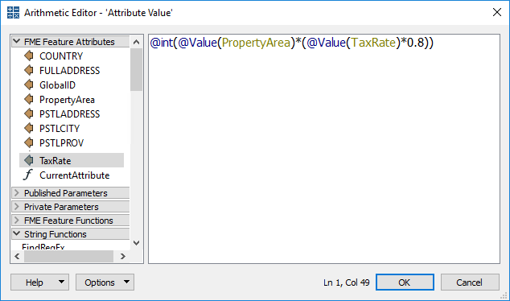
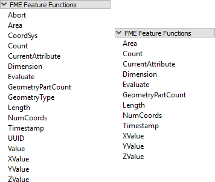

# Constructing Attributes #
Besides constant attribute values FME also allows you to construct values using string manipulation and arithmetic calculations. This is achieved using the menu opened by clicking on the arrow in the Attribute Value field:

This is very useful because the attribute now no longer is a fixed value: it can be constructed from a mix of existing attributes and parameters. The two main methods are the Text Editor and Arithmetic Editor.

---

## Text Editor ##
The text editor - as you would expect - allows you to construct a text value. It includes all the usual string-handling functionality you would need, such as concatenation, trimming, padding, and case changing.

The text editor looks like this:

Here the user is constructing a simple address string by concatenating various existing attributes. Notice the menu on the left hand side. Existing attributes are listed here and were added into the string by double-clicking them.

Also notice the other menu options. The most important (for a text editor) are the String Functions:

These are the functions that can be used to manipulate the strings being used. For example, here the user is making sure the attributes being used are trimmed when used:

---

## Arithmetic Editor ##

The arithmetic editor is much the same as the text editor, except that whatever is entered into the dialog will be evaluated as an arithmetic expression and a numeric result returned:

Here the user is calculating a resident's tax using a simple equation containing property area and a tax code. As with the text editor, existing attributes and arithmetic functions were obtained from the menu on the left-hand side.

---

### FME Feature Functions ##

One other item in the menu of both text and arithmetic editors is FME Feature Functions:

These are functions that reach into the very heart of FME's core functionality. They are the building blocks that transformers are built upon; basic functionality that can return values to the editor. 

For example, the @Area() function returns the area of the current feature (assuming it is a polygon). @Timestamp() returns the current time. They are the functional equivalent of the AreaCalculator and Timestamper transformers.

Some functions return strings, others return numeric values; therefore the available functions vary depending on whether the text or arithmetic editor is being used. In the screenshot above, the text editor functions are on the left and the arithmetic editor functions on the right. The text editor can use either text or numeric values; the arithmetic editor can only ever accept numeric values.

FME Feature Functions are useful because they allow you to build processing directly into the AttributeManager, instead of using a separate transformer.

---

### Replacing Other Transformers ###
Integrated text and arithmetic editors provide a great benefit for workspace creation. They allow attribute-creating functions to be carried out directly in a single transformer.

For example, the AttributeManager text editor can be used as a direct replacement for the StringConcatenator and ExpressionEvaluator transformers.

The AttributeManager could also replace the StringPadder and AttributeTrimmer transformers, albeit with a little less user-friendliness. If FME Feature Functions are used inside the editor, this transformer could also technically replace transformers such as the AreaCalculator, LengthCalculator, CoordinateCounter, TimeStamper, and many more.

This is usually a good thing. Workspaces will be more compact and well-defined when as many peripheral operations as possible are directly integrated into a single transformer. However, because it's possible for an AttributeManager to be carrying out one of many, many operations, it is also more important to use Best Practice and ensure it has proper annotation. 

If an AttributeManager is not properly annotated, it isn't possible to determine from looking at the Workbench canvas what action it is carrying out!

---

<!--Person X Says Section-->

<table style="border-spacing: 0px">
<tr>
<td style="vertical-align:middle;background-color:darkorange;border: 2px solid darkorange">
<i class="fa fa-quote-left fa-lg fa-pull-left fa-fw" style="color:white;padding-right: 12px;vertical-align:text-top"></i>
Miss Vector says...
</td>
</tr>

<tr>
<td style="border: 1px solid darkorange">

Here's a question to see if you are paying attention. Look at this screenshot of an editing dialog and tell me what the value returned to the attribute will be:
  
  <a href="http://52.73.3.37/fmedatastreaming/Manual/QAResponse2017.fmw?chapter=5&question=3&answer=1&DestDataset_TEXTLINE=C%3A%5CFMEOutput%5CQAResponse.html">1. 2+2</a>
 <a href="http://52.73.3.37/fmedatastreaming/Manual/QAResponse2017.fmw?chapter=5&question=3&answer=2&DestDataset_TEXTLINE=C%3A%5CFMEOutput%5CQAResponse.html">2. 4</a>
 <a href="http://52.73.3.37/fmedatastreaming/Manual/QAResponse2017.fmw?chapter=5&question=3&answer=3&DestDataset_TEXTLINE=C%3A%5CFMEOutput%5CQAResponse.html">3. 4.0</a>
 <a href="http://52.73.3.37/fmedatastreaming/Manual/QAResponse2017.fmw?chapter=5&question=3&answer=4&DestDataset_TEXTLINE=C%3A%5CFMEOutput%5CQAResponse.html">4. Error!</a>

</td>
</tr>
</table>

---

